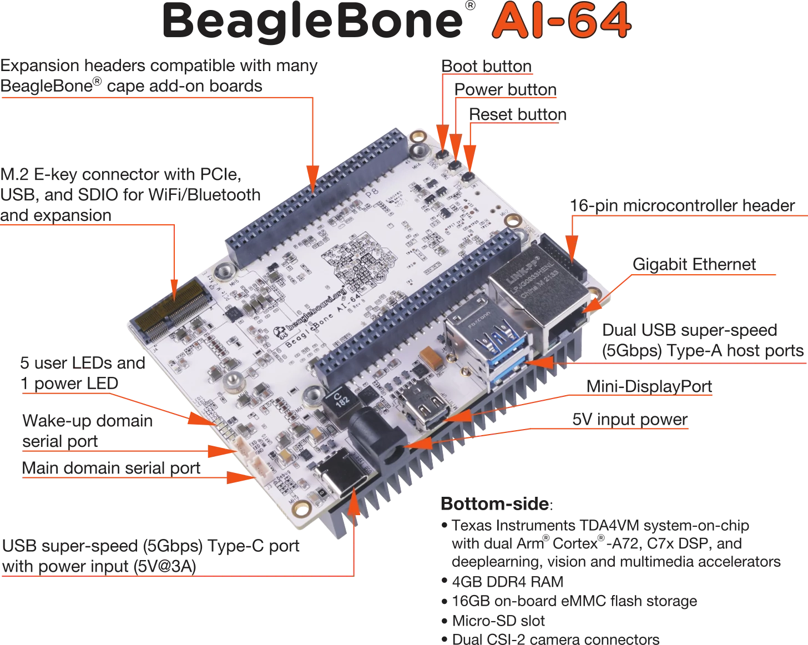
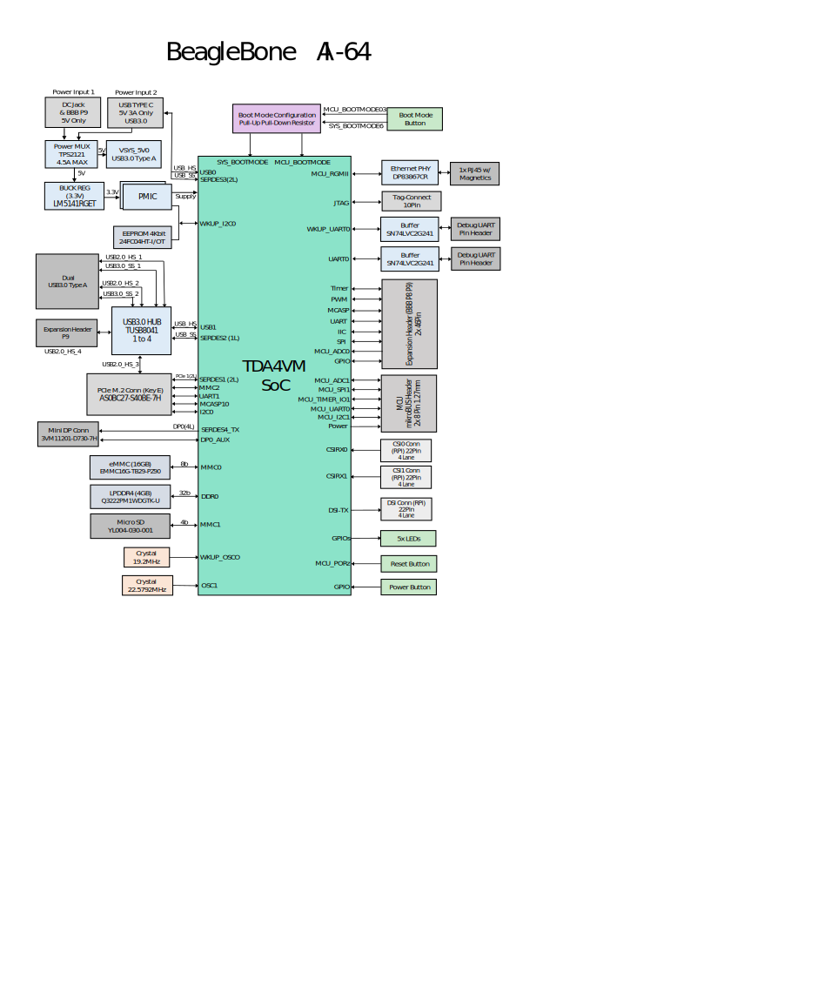

# BeagleBoard.org BeagleBone AI-64
 
BeagleBoard.org BeagleBone AI-64 - https://beaglebone.ai/64

[
    {: .shadow} 
](https://certification.oshwa.org/us002120.html)

## Project documentation release
* Latest system reference manual: [BeagleBone\_AI-64\_System\_Reference\_Manual](https://docs.beagleboard.org/latest/boards/beaglebone/ai-64/)
* Latest schematic: [BeagleBone\_AI-64\_Rev\_B1\_SCH\_220602.pdf](https://git.beagleboard.org/beagleboard/beaglebone-ai-64/-/raw/main/hw/BeagleBone_AI-64_Rev_B1_SCH_220602.pdf?inline=false)

## Key features

## Block diagram

## Other
* Latest instructions: [beagleboard.org/getting-started](https://beagleboard.org/getting-started)
* Software update instructions: [beagleboard.org/update-ai64](https://beagleboard.org/update-ai64)
* Latest software: [beagleboard.org/latest-images](https://beagleboard.org/latest-images)
* Latest product information: [beagleboard.org/ai-64](https://beagleboard.org/ai-64)
* Design: [git.beagleboard.org/beagleboard/beaglebone-ai-64](https://git.beagleboard.org/beagleboard/beaglebone-ai-64)
* Support: [beagleboard.org/support](https://beagleboard.org/support)
* Repair issues: [beagleboard.org/rma](https://beagleboard.org/rma)
* Newsletter: [beagleboard.org/newsletter](https://beagleboard.org/newsletter)
