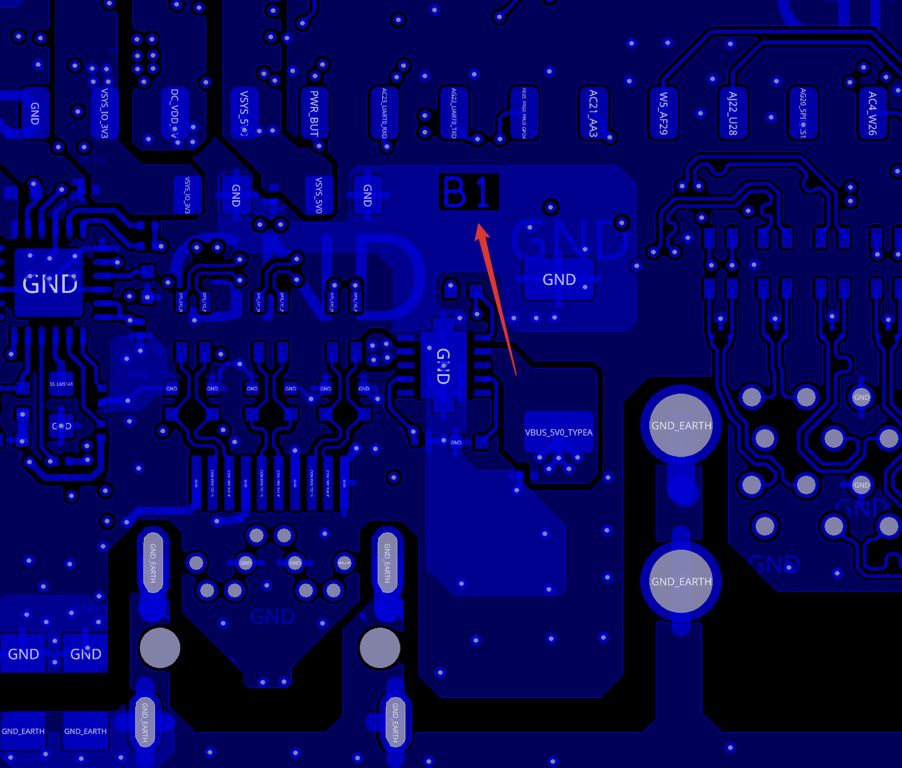
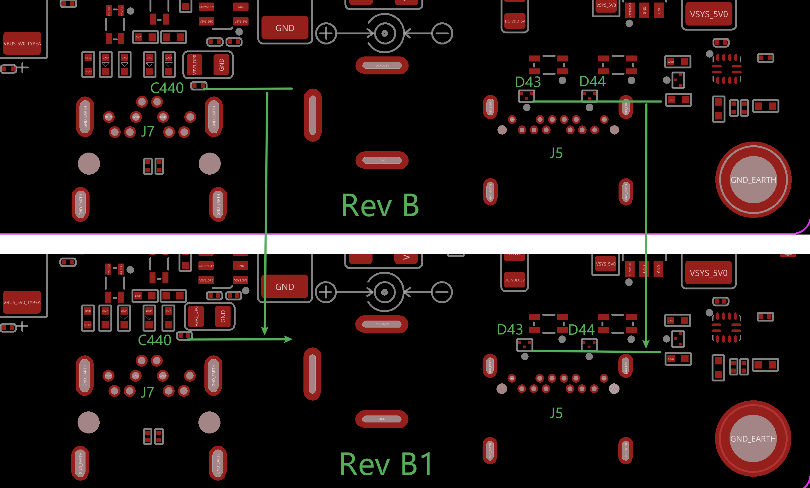

[[change-history]]
== Change History

This section describes the change history of this document and board.
Document changes are not always a result of a board change. A board
change will always result in a document change.

[[document-change-history]]
=== Document Change History

This table seeks to keep track of major revision cycles in the documentation. Moving forward, we'll seek to align these version numbers across all of the various documentation.

.Change History
[[change-history-table, Change History]]
[cols="1,7,2,1",options="header",]
|=======================================================================
|*Rev* |*Changes*                  |*Date*         |*By*
|0.0.1 |AI-64 initial prototype    |September 2021 |James Anderson
|0.0.2 |AI-64 final prototype      |December 2021  |James Anderson
|0.0.3 |AI-64 initial production release |June 9, 2022   |Deepak Khatri and Jason Kridner
|0.0.4 |AI-64 DFM update |June 13, 2022   |Jason Kridner and Deepak Khatri
|=======================================================================

[[board-changes]]
=== Board Changes

Be sure to check the board revision history in the schematic file in the
https://git.beagleboard.org/beagleboard/beaglebone-ai-64[BeagleBone AI-64 git repository].
Also check the https://git.beagleboard.org/beagleboard/beaglebone-ai-64/-/issues[issues list].

[[rev-B]]
==== Rev B

We are starting with revision B based on this being an update to the BeagleBone AI. However, because this board ended up being so different, we've decided to name it BeagleBone AI-64, rather than simply a new revision. This refers to the Seeed release on 21 Dec 2021 of "BeagleBone AI-64_SCH_Rev B_211221". This is the initial production release.

[[rev-B1]]
==== Rev B1

This revision was made based on design-for-manufacturing updates after the initial production pilot run. 

This refers to the Seeed release on 02 Jun 2022 of "BeagleBone AI-64_SCH_Rev B1_220602".

The changes are:

* MH4, MH5, MH6, MH7: Changed the hole diameter from 4.5MM to 4.4MM.
* R0201, C0201: Changed the distance between two pads from 0.28MM to 0.23MM.
* Type C Connector J5: Changed the diameter of location hole from 0.65MM to 0.75MM.
* Wave SoIdering: Moved D43 D44 away from J5; Moved C440 away from J7.
* PCB Revision: Added "B1" on the PCB bottom for internal record.

