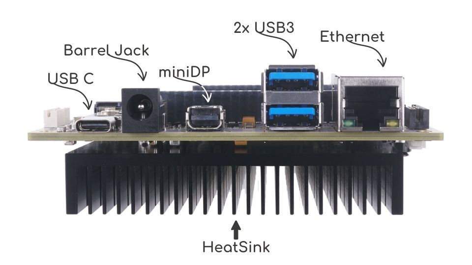
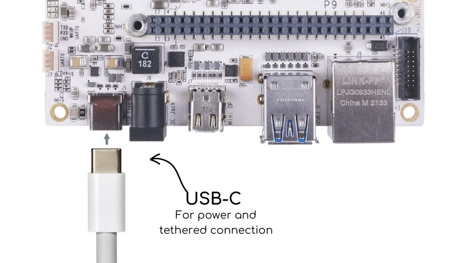
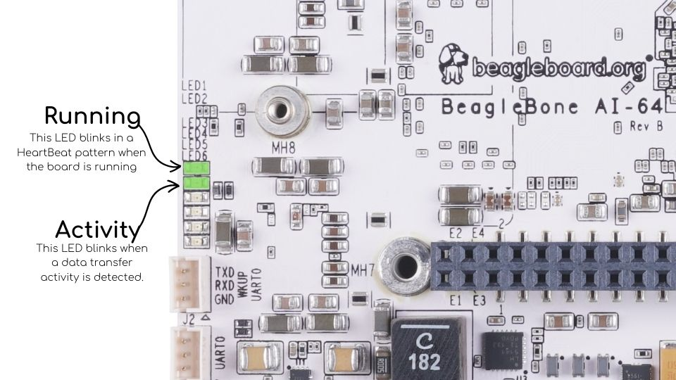
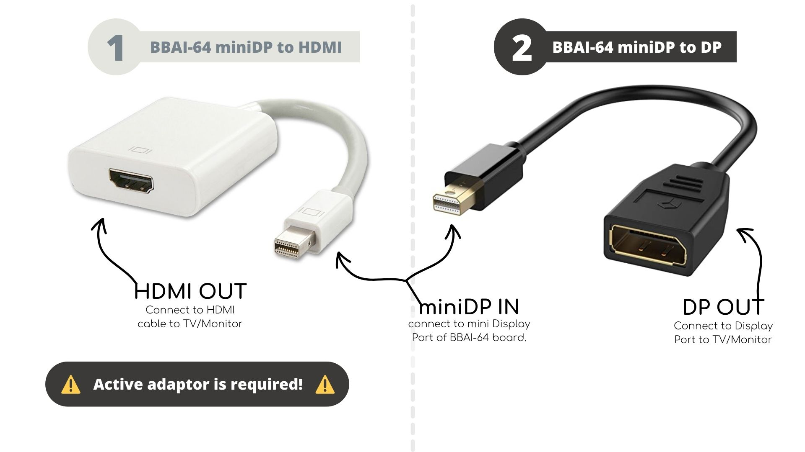
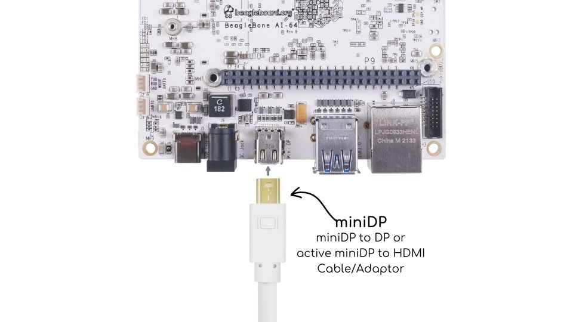

[[connecting-up-your-beaglebone-ai-64]]
== Connecting up your BeagleBone AI-64

This section provides instructions on how to hook up your board. This
beagle requires a 5V ≥ 3A power supply to work properly via either 
USB Type-C power adapter or a barrel jack power adapter. 

Recommended adapters:

* 5V @ 3A https://www.digikey.com/en/products/detail/raspberry-pi/RPI-USB-C-power-supply-White-US/10258760[USB C power supply] adaptor for SBCs.
* 5V ≥ 3A laptop/mobile adaptor with USB-C cable.

All the <<bbai-ports>> we will use in this chapter 
are shown in the figure below.

[[bbai-ports,BeagleBone AI-64 conections ports]]

=== 3.0.1 Methods of operation

1.  Tethered to a PC, or
2.  As a standalone development platform in a desktop PC configuration with a Display Port Monitor, power supply, keyboard, and mouse 

[[whats-in-the-box]]
=== What’s In the Box

In the box you will find three main items as shown in <<bbai-64-pacakage>>.

* BeagleBone AI-64.
* Instruction card.

Get yourself a USB-A to USB-C and you have a setup for 
the tethered scenario and creates an out of box
experience where the board can be used immediately with 
no other equipment needed.

[[bbai-64-pacakage,BeagleBone AI-64 box image]]
image::images/ch03/bbai64-in-box.jpg[title="BeagleBone AI-64 box content"]

[[main-connection-scenarios]]
=== Main Connection Scenarios

This section will describe how to connect the board for use. This
section is basically a slightly more detailed description of the Quick
Start Guide that came in the box. There is also a Quick Start Guide
document on the board that should also be referred to. The intent here
is that someone looking to purchase the board will be able to read this
section and get a good idea as to what the initial set up will be like.

The board can be configured in several different ways, but we will
discuss the two most common scenarios as described in the Quick Start
Guide card that comes in the box.

* Tethered to a PC via the USB cable
** Board is accessed as a storage drive and
** a virtual Ethernet connection.
* Standalone desktop 
** Display
** Keyboard and mouse
** External 5V ≥ 3A power supply

Each of these configurations is discussed in general terms in the
following sections.

[[tethered-to-a-pc]]
=== Tethered To A PC

In this configuration, the board is powered by the PC via the provided
USB cable--no other cables are required. The board is accessed either as
a USB storage drive or via the browser on the PC. You need to use either
Firefox or Chrome on the PC, Internet Explorer will not work properly. 
<<tethered-figure>> shows this configuration.

[[tethered-figure,Tethered Configuration figure]]
image::images/ch03/usb-tethering.jpg[title="Tethered Configuration"]

At least 5V @ 3A is required to power the board, In most cases 
the PC may not be able to supply sufficient power for
the board. You should always use an external 5V ≥ 3A DC 
power supply connected to the barrel jack.

[[connect-the-cable-to-the-board]]
==== Connect the Cable to the Board

1. Connect the type C USB cable to the board as shown
in <<usb-c-connect-figure>>. The connector is on the 
top side of the board near barrel jack.
+
[[usb-c-connect-figure,USB Connection to the Board figure]]

2.  Connect the USB-A end of thecable tp your PC or laptop USB 
port as shown in the <<usb-a-connect-figure>> below.
+
[[usb-a-connect-figure,USB Connection to the PC/Laptop figure]]
image::images/ch03/usb-a-connection.jpg[title="USB Connection to the PC/Laptop"]
3.  The board will power on and the power LED will be on as shown in
<<power-led-figure>> below.
+
[[power-led-figure,Board Power LED figure]]
image::images/ch03/power-led.jpg[title="Board Power LED"]
4. When the board starts to the booting process started by the process
of applying power, the LEDs will come on in sequence as shown in <<boot-status-figure>>
below. It will take a few seconds for the status LEDs to come on, so
be patient. The LEDs will be flashing in an erratic manner as it begins
to boot the Linux kernel.
+
[[boot-status-figure,Board Boot Status figure]]

[[accessing-the-board-as-a-storage-drive]]
==== Accessing the Board as a Storage Drive

The board will appear around a USB Storage drive on your PC after the
kernel has booted, which will take a round 10 seconds. The kernel on the
board needs to boot before the port gets enumerated. Once the board
appears as a storage drive, do the following:

1.  Open the USB Drive folder.
2.  Click on the file named *start.htm*
3.  The file will be opened by your browser on the PC and you should get
a display showing the Quick Start Guide.
4.  Your board is now operational! Follow the instructions on your PC
screen.

[[standalone-wdisplay-and-keyboardmouse]]
=== Standalone w/Display and Keyboard/Mouse

In this configuration, the board works more like a PC, totally free from
any connection to a PC as shown in <<desktop-config-figure>>. It allows you to create
your code to make the board do whatever you need it to do. It will
however require certain common PC accessories. These accessories and
instructions are described in the following section.

[[desktop-config-figure,Desktop Configuration figure]]
image::images/ch03/desktop-configuration.jpg[title="Desktop Configuration"]

Ethernet cable and M.2 WiFi + Bluetooth card are optional. They can be used if network access required.

[[required-accessories]]
==== Required Accessories

In order to use the board in this configuration, you will need the
following accessories:

* 5VDC ≥ 3A power supply.
* Display Port or HDMI monitor.
* miniDP-DP or active miniDP-HDMI cable 
(or a recommended *miniDP-DP or active miniDP-HDMI adapter* 
https://www.amazon.com/dp/B089GF8M87 
has been tested and worked beautifully.).
* USB wired/wireless keyboard and mouse.
* powered USB HUB (OPTIONAL). The board has only two USB Type-A host ports, so you may need to use a powered USB Hub if you wish to add additional USB devices, such as a USB WiFi adapter.
* M.2 Bluetooth & WiFi module (OPTIONAL). For wireless connections, a USB WiFi adapter or a recommended M.2 WiFi module can provide wireless networking.

[[connecting-up-the-board]]
==== Connecting Up the Board

1. Connect the miniDP to DP or active miniDP to HDMI cable from your BeagleBone AI-64 to your monitor.
+
[[display-cable-figure,miniDP-DP or active miniDP-HDMI cable connection figure]]
image::images/ch03/monitor-cable.jpg[title="Connect miniDP-DP or active miniDP-HDMI cable to BeagleBone AI-64"]

2. If you have an Display Port or HDMI monitor with HDMI-HDMI or DP-DP cable you can use adapters as shown in. <<display-adaptors-figure>>.
+
[[display-adaptors-figure,Display adaptors figure]]

3. If you have wired/wireless USB keyboard and mouse such as
+
seen in <<keyboard-mouse-figure>> below, you need to plug the receiver in the USB host
port of the board as shown in <<keyboard-mouse-figure>>.
+
[[keyboard-mouse-figure,Keyboard and Mouse figure]]
image::images/ch03/mouse-keyboard.jpg[title="Keyboard and Mouse"]
+
4. Connect the Ethernet Cable
+
If you decide you want to connect to your local area network, an
Ethernet cable can be used. Connect the Ethernet Cable to the Ethernet
port as shown in <<ethernet-cable-figure>. Any standard 100M Ethernet cable should
work.
+
[[ethernet-cable-figure,Ethernet Cable Connection figure]]
image::images/ch03/ethernet-cable.jpg[title="Ethernet Cable Connection"]

5. The final step is to plug in the DC power supply to the DC power jack as
shown in <<barrel-jack-figure>> below.
+
[[barrel-jack-figure,External DC Power figure]]
image::images/ch03/barrel-jack.jpg[title="External DC Power"]

6. The cable needed to connect to your display is a miniDP-DP or active miniDP-HDMI.
Connect the miniDP connector end to the board at this time. The
connector is on the top side of the board as shown in <<miniDP-figure>>
below.
+
[[miniDP-figure,miniDP to DP or active miniDP to HDMI connection figure]]

+
The connector is fairly robust, but we suggest that you not use the
cable as a leash for your Beagle. Take proper care not to put too much
stress on the connector or cable.

7. Booting the Board
+
As soon as the power is applied to the board, it will start the booting
up process. When the board starts to boot the LEDs will come on. It will take a few seconds for
the status LEDs to come on, so be patient. The LEDs will be flashing in
an erratic manner as it boots the Linux kernel.
+
[[LEDs-figure,BeagleBone AI-64 LEDs figure]]
image::images/ch03/leds.jpg[title="BeagleBone AI-64 LEDs"]
+
While the four user LEDS can be over written and used as desired, they
do have specific meanings in the image that is shipped with the board
once the Linux kernel has booted.
+
* *USR0* is the heartbeat indicator from the Linux kernel.
* *USR1* turns on when the microSD card is being accessed
* *USR2* is an activity indicator. It turns on when the kernel is not
in the idle loop.
* *USR3* turns on when the onboard eMMC is being accessed.
* *USR4* is an activity indicator for WiFi.

8. A Booted System
.. The board will have a mouse pointer appear on the screen as it
enters the Linux boot step. You may have to move the physical mouse to
get the mouse pointer to appear. The system can come up in the suspend
mode with the monitor in a sleep mode.
.. After a minute or two a login screen will appear. You do not have to
do anything at this point.
.. After a minute or two the desktop will appear. It should be similar
to the one shown in <<figure-16>>. HOWEVER, it will change from one
release to the next, so do not expect your system to look exactly like
the one in the figure, but it will be very similar.
.. And at this point you are ready to go! <<figure-16>> shows the desktop
after booting.
+
[[figure-16,Figure 16]]
.Figure 16. Desktop Screen
image::images/ch03/xfce-desktop.jpg[title="BeagleBone XFCE Desktop Screen"]
