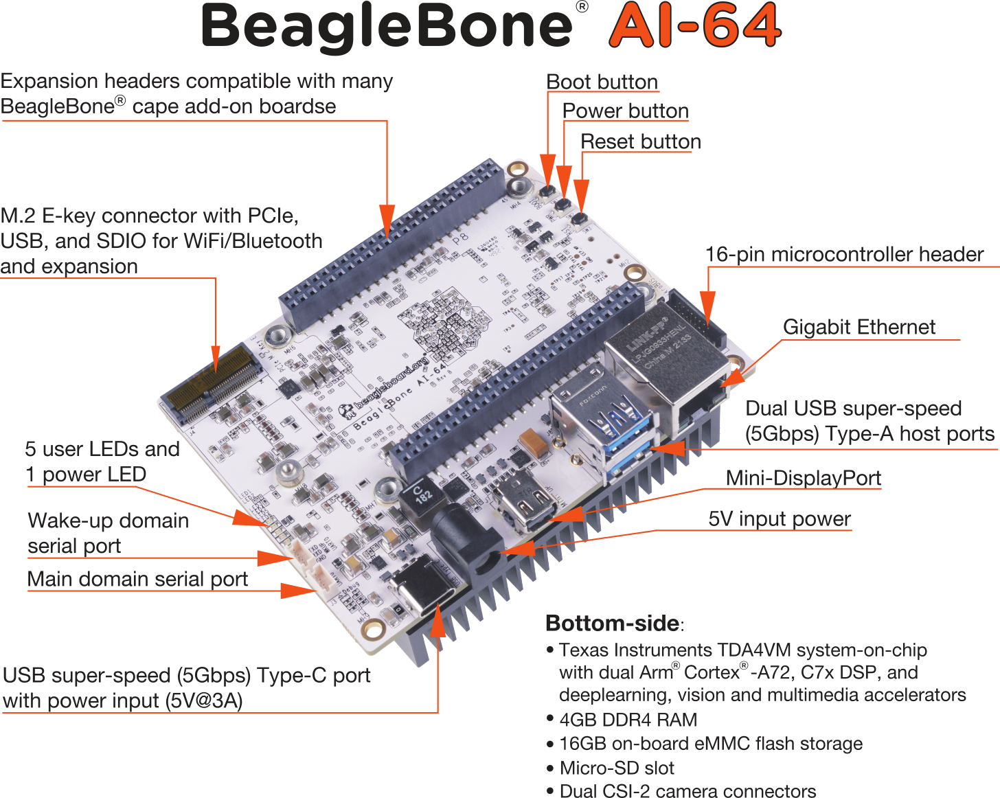

[[beaglebone-ai-64-overview]]
== BeagleBone AI-64 Overview

BeagleBone AI-64 is the latest addition to BeagleBoard.org
family and like its predecessors, is designed to address the open-source
Community, early adopters, and anyone interested in a low cost
64-bit Dual Arm® Cortex®-A72 processor based Single Board Computer (SBC).

It has been equipped with a minimum set of features to allow the user to
experience the power of the processor and is not intended as a full
development platform as many of the features and interfaces supplied by
the processor are not accessible from BeagleBone AI-64 via onboard
support of some interfaces. It is not a complete product designed to do
any particular function. It is a foundation for experimentation and
learning how to program the processor and to access the peripherals by
the creation of your own software and hardware.

It also offers access to many of the interfaces and allows for the use
of add-on boards called capes, to add many different combinations of
features. A user may also develop their own board or add their own
circuitry.

BeagleBone AI-64 is manufactured and warranted by partners listed at
https://beagleboard.org/logo for the benefit of the community and its
supporters including the current BeagleBoard.org Foundation board members

* Jason Kridner, principal of JK Embedded Consulting an 
independent contractor and architect for new Beagle designs.
* Drew Fustini, independent Linux developer
* Robert Nelson, applications engineer at Digi-Key
* Mark Yoder, professor at Rose-Hulman Institute of Technology
* Kathy Giori, product engineer at ZEDEDA

See bbb.io/about

The BeagleBone AI-64 board is designed designed 
by Seeed Studio (Seeed Development Limited) 
under guidance from BeagleBoard.org Foundation.

[[beaglebone-compatibility]]
=== BeagleBone Compatibility
The board is intended to be compatible with the original BeagleBone as
much as possible. There are several areas where there are differences
between the two designs. These differences are listed below, along with
the reasons for the differences.

* J721E DRA829/TDA4VM/AM752x, 2GHZ, 64 Bit, multicore processor.
* 4GB LPDDR4
* Debug TTL serial.
* EEPROM Reduced from 4KB to 1KB
* Onboard Managed NAND (16GB eMMC)
* There may be 10 less GPIO pins available
* Mini Display Port (iniDP) interface onboard
* Dual USB-3 ports.

[[beaglebone-ai-64-features-and-specification]]
=== BeagleBone AI-64 Features and Specification

This section covers the specifications and features of the board and
provides a high level description of the major components and interfaces
that make up the board.

<<table-2>> provides a list of the features.

[[table-2,Table 2]]
.Table 2. BeagleBone AI-64 Features
[cols="1h,3",options="header",]
|=======================================================================
| |*Feature*
|*Processor* | TI J721E DRA829/TDA4VM/AM752x
|*Graphics Engine* | PowerVR® Series8XE GE8430
|*SDRAM Memory* |LPDDR4 (4GB) Q3222PM1WDGTK-U
|*Onboard Flash* | eMMC (16GB) EMMC16G-TB29-PZ90
|*PMIC* |TPS65941213 and TPS65941111 PMICs regulator and one additional LDO.
|*Debug Support* | 3 pin Serial Header
|*Power Source* | USB C or DC Jack
|*PCB* | This beagle is not the standard 3.4” x 2.1”, It’s grown in size to 4” x 3.1”
|*Indicators* |1-Power, 5-User Controllable LEDs
|*HS USB-3.0 Client Port* |Access to USB0, Client mode via USB-C
|*HS USB-3.0 Host Port* |Access to USB1 & USB2, Type A Socket, 1.5A
|*Serial Port* | 1. WKUP_UART0: Wake-up domain serial port +
2. UART0: Main domain serial port

Access via 3 pin 3.3V TTL micro header.
|*Ethernet* |Gigabit, RJ45
|*SD/MMC Connector* |microSD , 1.8/3.3V
|*User Input* |1. Reset Button +
2. Boot Button +
3. Power Button
|*Video Out* | miniDP
|*Audio* | via miniDP Interface, Stereo
|*Weight* | 192gm (with heatsink)
|*Power* |Refer to <<main-board-power>> section
|=======================================================================

[[board-component-locations]]
=== Board Component Locations

This section describes the key components on the board. It provides
information on their location and function. Familiarize yourself with
the various components on the board.

[[board-componets]]
==== Board components

<<board-componets-figure>> below shows the locations of the connectors, LEDs, and
switches on the PCB layout of the board.

[[board-componets-figure,BeagleBone AI-64 board components figure]]

* *DC Power* is the main DC input that accepts 5V power.
* *Power Button* alerts the processor to initiate the power down
sequence and is used to power down the board.
* *GigaBit Ethernet* is the connection to the LAN.
* *Serial Debug ports* WKUP_UART0 for early boot from the management MCU 
and UART0 is for the main processor.
* *USB Client* is a USB-C connection to a PC that can also power the
board.
* *BOOT switch* can be used to force a boot from the microSD card if the
power is cycled on the board, removing power and reapplying the power to
the board..
* There are five green **LEDs** that can be used by the user.
* *Reset Button* allows the user to reset the processor.
* *microSD* slot is where a microSD card can be installed.
* *miniDP* connector is where the display is connected to.
* *USB Host* can be connected different USB interfaces such as Wi-Fi,
BT, Keyboard, etc.

On bottom side we have,

* *TI J721E DRA829/TDA4VM/AM752x* processor.
* *4GB LPDDR4L* Dual Data Rate RAM memory.
* *Ethernet PHY* physical interface to the network.
* *eMMC* onboard MMC chip that holds up to 16GB of data.
* *miniDP* Framer provides control for a DP/HDMI display with an adapter.
