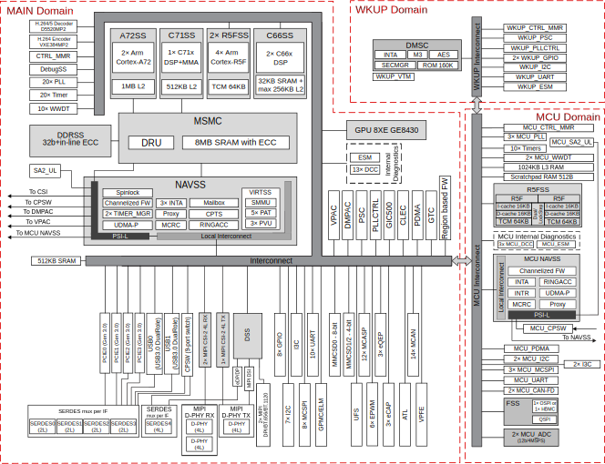

[[beaglebone-ai-64-high-level-specification]]
== BeagleBone AI-64 High Level Specification

<<bbai-64-block-diagram-ch05>> below shows the high level block diagram of BeagleBone
AI-64 board surrounding TDA4VM SoC.

[[bbai-64-block-diagram-ch05,BeagleBone AI-64 Key Components figure]]
image::images/ch05/board-block-diagram.svg[title="BeagleBone AI-64 Key Components"]

[[processor]]
=== Processor

BeagleBone AI-64 uses TI J721E https://www.ti.com/product/DRA829V[DRA829]/
https://www.ti.com/product/TDA4VM[TDA4VM] whoch is part of the K3 Multicore SoC architecture platform 
and it is targeted for the reliability and low-latency needs of the automotive market provide for a great 
general purpose platform suitable for industrial automation, mobile robotics, building automation and numerous hobby projects.

The SoC designed as a low power, high performance and highly integrated device architecture, adding
significant enhancement on processing power, graphics capability, video and imaging processing, virtualization
and coherent memory support. In addition, these SoCs support state of the art security and functional safety
features. For the remaining of this section device, SoC, and processor will be used interchangeably. 

*Some of the main distinguished characteristics of the device are:*

* 64-bit architecture with virtualization and coherent memory support, which leverages full processing capability
of 64-bit Arm® Cortex®-A72
* Fully programmable industrial communication subsystems to enable future-proof designs for customers that
need to adopt the new Gigabit Time-sensitive Networks (TSN) standards, but still need full support on legacy
protocols and continuous system optimization over the product deployment
* Integration of vision hardware processing accelerators to facilitate extensive processing requirements in low
power budget for automotive ADAS and machine vision applications
* Integration of a general-purpose microcontroller unit (MCU) with a dual Arm® Cortex®-R5F MCU subsystem,
available for general purpose use as two cores or in lockstep, intended to help customers achieve functional
safety goals for their end products
* Integration of a next-generation fixed and floating-point C71x Digital Signal Processor (DSP) that significantly
boosts power over a broad range of general signal processing tasks for both general applications and
automotive functions which also incorporates advanced techniques to improve control code efficiency and
ease of programming such as branch prediction, protected pipeline, precise exception and virtual memory
management
* Tightly coupled Matrix Multiplication Accelerator (MMA) that extends the C71x DSP architecture's scalar and
vector facilities enabling deep learning and enhance vision, analytics and wide range of general applications.
The achieved total TOPS (Tera Operations Per Second) performance significantly differentiates the device for
single board computer in machine vision and deep learning applications
* Key display features including flexibility to interface with different panel types (eDP, DSI, DPI) with multi-layer
hardware composition
* Integration of hardware features that help applications to achieve functional safety mechanisms
* Robust security architecture with sandboxed DMSC controller managing all secure configurations with high
performance client-server messaging scheme between secure DMSC and all cores
* Simplified solution for power supply management, enabling lower cost system solution (on-die bias LDOs and
power good comparators for minimal power sequencing requirements consistent with low cost supply design)

*The device is composed of the following main subsystems, across different domains of the SoC, among others:*

* One dual-core 64-bit Arm Cortex-A72 microprocessor subsystem at up to 2.0 GHz and up to 24K DMIPS
(Dhrystone Million Instructions per Second)
* Up to three Microcontroller Units (MCU), based on dual-core Arm Cortex-R5F processor running at up to 1.0
GHz, up to 12K DMIPS
* Up to two TMS320C66x DSP CorePac modules running at up to 1.35 GHz, up to 40 GFLOPS
* One C71x floating point, vector DSP running at up to up to 1.0 GHz, up to 80 GFLOPS
* One deep-learning MMA, up to 8 TOPS (8b) at 1.0 GHz
* Up to two gigabit dual-core Programmable Real-Time Unit and Industrial Communication Subsystems
(PRU_ICSSG)
* Two Navigator Subsystems (NAVSS) for data movement and control
* One multi-pipeline Display Subsystem (DSS) with one MIPI® Display Serial Interface Controller (DSI) and
shared MIPI D-PHY Transmitter (DPHY_TX), one Embedded DisplayPort Transmitter (EDP) with shared
Serializer/Deserializer (SERDES), and two MIPI Display Pixel Interface (DPI) ports
* Two Camera Streaming Interface Receivers (CSI_RX_IF) with dedicated MIPI D-PHYs (DPHY_RX)
* One Camera Streaming Interface Transmitter (CSI_TX_IF) with MIPI D-PHY Transmitter (DPHY_TX) shared
with DSI
* One Vision Processing Accelerator (VPAC) with image signal processor
* One Depth and Motion Processing Accelerator (DMPAC)
* One dual-core multi-standard HD Video Decoder (DECODER)
* One dual-core multi-standard HD Video Encoder (ENCODER)
* One Graphics Processing Unit (GPU)
* One Device Management and Security Controller (DMSC)

*The device provides a rich set of peripherals such as:*

* General connectivity peripherals, including:
** Two 12-bit general purpose Analog-to-Digital Converters (ADC)
** Ten Inter-Integrated Circuit (I2C) interfaces
** Three Improved Inter-Integrated Circuit (I3C) controllers
** Eleven master/slave Multichannel Serial Peripheral Interfaces (MCSPI)
** Twelve configurable Universal Asynchronous Receiver/Transmitter (UART) interfaces
** Ten General-Purpose Input/Output (GPIO) modules

* High-speed interfaces, including:
** Two Gigabit Ethernet Switch (CPSW) modules
** Two Dual-Role-Device (DRD) Universal Serial Bus Subsystems (USBSS) with integrated PHY
** Four Peripheral Component Interconnect express (PCIe) Gen3 subsystems

* Flash memory interfaces, including:
** One Octal SPI (OSPI) interface and one Quad SPI (QSPI) or one QSPI and one HyperBus^TM^
** One General Purpose Memory Controller (GPMC) with Error Location Module (ELM) and 8- or 16-
bit-wide data bus width (supports parallel NOR or NAND FLASH devices)
** Three Multimedia Card/Secure Digital (MMCSD) controllers
** One Universal Flash Storage (UFS) interface

* Industrial and control interfaces, including:
** Sixteen Controller Area Network (MCAN) interfaces with flexible data rate support
** Three Enhanced Capture (ECAP) modules
** Six Enhanced Pulse-Width Modulation (EPWM) subsystems
** Three Enhanced Quadrature Encoder Pulse (EQEP) modules

* Audio peripherals, including:
** One Audio Tracking Logic (ATL)
** Twelve Multichannel Audio Serial Port (MCASP) modules supporting up to 16 channels with independent
TX/RX clock/sync domain

* One Video Processing Front End (VPFE) interface module

*The device also integrates:*

* Power distribution, reset controls and clock management components

* Power-management techniques for device power consumption minimization:
** Adaptive Voltage Scaling (AVS)
** Dynamic Frequency Scaling (DFS)
** Gated clocks
** Multiple voltage domains
** Independently controlled power domains for major modules
** Voltage and Temperature Management (VTM) module
** Power-on Reset Generators (PRG)
** Power Sleep Controllers (PSC)

* Optimized interconnect (CBASS) architecture to enable latency-critical real time network and IO applications

* Control modules (CTRL_MMRs) mainly associated with device top-level configurations such as:
** IO Pad and pin multiplexing configuration
** PLL control and associated High-Speed Dividers (HSDIV)
** Clock selection
** Analog function controls

* Multicore Shared Memory Controller (MSMC)
* DDR Subsystem (DDRSS) with Error Correcting Code (ECC), supporting LPDDR4
* 1KB RAM with ECC support for C71x boot vectors
* 2KB RAM with ECC support for A72 and R5F boot vectors
* 512KB On-Chip SRAM protected by ECC
* One Global Time Counter (GTC) module
* Thirty 32-bit counter timers with compare and capture modes
* Debug and trace capabilities

*The device includes different modules for functional safety requirements support:*

* MCU island with dual lock step Arm Cortex-R5F
* Safety enabled interconnect with implemented features to help with Freedom From Interference (FFI)
* Twelve Real Time Interrupt (RTI) modules with Windowed Watchdog Timer (WWDT) functionality to monitor
processor cores
* Sixteen Dual-Clock Comparators (DCC) to monitor clocking sources during run-time
* Three Error Signaling Modules (ESM) to enable error monitoring
* Temperature monitoring sensors
* ECC on all critical memories
* Dedicated hardware Memory Cyclic Redundancy Check (MCRC) blocks

*The device supports the following main security functionalities among others:*

* Secure Boot Management
* Public Key Accelerator (PKA) for large vector math operation
* Cryptographic acceleration (AES, 3DES, MD5, SHA1, SHA2-224, 256, 512 operation)
* Trusted Execution Environment (TEE)
* Secure storage support
* On-the-fly encryption and authentication support for OSPI interface

The device is partitioned into three functional domains as shown in <<soc-block-diagram>>, 
each containing specific processing cores and peripherals:

* Wake-up (WKUP) domain
* Microcontroller (MCU) domain with one of the dual Cortex-R5 cluster
* MAIN domain

[[soc-block-diagram,Device Top-level Block Diagram]]

[[memory]]
=== Memory

Described in the following sections are the three memory devices found
on the board.

[[mb-ddr4l]]
==== 4GB LPDDR4

A single (1024M x 16bits x 2channels) LPDDR4 4Gb memory device is used. The memory
used is is:

* Q3222PM1WDGTK-U

[[kb-eeprom]]
==== 4Kb EEPROM

A single 4Kb EEPROM (24FC04HT-I/OT) is provided on I2C0 that holds the board
information. This information includes board name, serial number, and
revision information. This is the not the same as the one used on the
original BeagleBone. The device was changed for cost reduction reasons.
It has a test point to allow the device to be programmed and otherwise
to provide write protection when not grounded.

[[gb-embedded-mmc]]
==== 16GB Embedded MMC

A single 16GB embedded MMC (eMMC) device is on the board. The device
connects to the MMC1 port of the processor, allowing for 8bit wide
access. Default boot mode for the board will be MMC1 with an option to
change it to MMC0, the SD card slot, for booting from the SD card as a
result of removing and reapplying the power to the board. Simply
pressing the reset button will not change the boot mode. MMC0 cannot be
used in 8Bit mode because the lower data pins are located on the pins
used by the Ethernet port. This does not interfere with SD card
operation but it does make it unsuitable for use as an eMMC port if the
8 bit feature is needed.

[[microsd-connector]]
==== MicroSD Connector

The board is equipped with a single microSD connector to act as the
secondary boot source for the board and, if selected as such, can be the
primary boot source. The connector will support larger capacity microSD
cards. The microSD card is not provided with the board. Booting from
MMC0 will be used to flash the eMMC in the production environment or can
be used by the user to update the SW as needed.

[[boot-modes]]
==== Boot Modes

As mentioned earlier, there are two boot modes:

* **eMMC Boot…**This is the default boot mode and will allow for the
fastest boot time and will enable the board to boot out of the box using
the pre-flashed OS image without having to purchase an microSD card or
an microSD card writer.
* **SD Boot…**This mode will boot from the microSD slot. This mode can
be used to override what is on the eMMC device and can be used to
program the eMMC when used in the manufacturing process or for field
updates.

_Software to support USB and serial boot modes is not provided by
beagleboard.org._ _Please contact TI for support of this feature._

A switch is provided to allow switching between the modes.

* Holding the boot switch down during a removal and reapplication of
power without a microSD card inserted will force the boot source to be
the USB port and if nothing is detected on the USB client port, it will
go to the serial port for download.
* Without holding the switch, the board will boot try to boot from the
eMMC. If it is empty, then it will try booting from the microSD slot,
followed by the serial port, and then the USB port.
* If you hold the boot switch down during the removal and reapplication
of power to the board, and you have a microSD card inserted with a
bootable image, the board will boot from the microSD card.

_NOTE: Pressing the RESET button on the board will NOT result in a
change of the_ _boot mode. You MUST remove power and reapply power to
change the boot mode._ _The boot pins are sampled during power on reset
from the PMIC to the processor._ _The reset button on the board is a
warm reset only and will not force a boot mode_ _change._

[[power-management]]
=== Power Management

The *TPS65941213 and TPS65941111* power management device is used along with a separate
LDO to provide power to the system. The**TPS65941213 and TPS65941111** version provides
for the proper voltages required for the LPDDR4. This is the same device
as used on the original BeagleBone with the exception of the power rail
configuration settings which will be changed in the internal EEPROM to
the *TPS65941213 and TPS65941111* to support the new voltages.

LPDDR4 requires 1.5V instead of 1.8V on the DDR2 as is the case on the
original BeagleBone. The 1.8V regulator setting has been changed to 1.5V
for the LPDDR4. The LDO3 3.3V rail has been changed to 1.8V to support
those rails on the processor. LDO4 is still 3.3V for the 3.3V rails on
the processor. An external *LDOTLV70233* provides the 3.3V rail for the
rest of the board.

[[pc-usb-interface]]
=== PC USB Interface

The board has a USB type-C connector that connects the USB0 port to the
processor. This is the same connector as used on the original
BeagleBone.

[[serial-debug-ports]]
=== Serial Debug Ports

Two serial debug ports are provided on board via 3pin micro headers,

1. WKUP_UART0: Wake-up domain serial port
2. UART0: Main domain serial port

In order to use the interfaces a 
https://uk.farnell.com/element14/1103004000156/beaglebone-ai-serials-cable/dp/3291081[3pin micro to 6pin dupont adaptor header] 
is required with a 6 pin USB to TTL adapter. The header is compatible with 
the one provided by FTDI and canbe purchased for about $$12 to $$20 from 
various sources. Signals supported are TX and RX. None of the handshake 
signals are supported.

[[usb1-host-port]]
=== USB1 Host Port

On the board is a single USB Type A female connector with full LS/FS/HS
Host support that connects to USB1 on the processor. The port can
provide power on/off control and up to 1.5A of current at 5V. Under USB
power, the board will not be able to supply the full 1.5A, but should
be sufficient to supply enough current for a lower power USB device
supplying power between 50 to 100mA.

[[power-sources]]
=== Power Sources

The board can be powered from two different sources:

* A 5V ≥ 3A power supply plugged into the barrel jack.
* A wall adaptor with 5V ≥ 3A output power.

The power supply is not provided with the board but can be easily
obtained from numerous sources. A 5V ≥ 3A supply is mandatory to have with
the board, but if there is a cape plugged into the board or you have a power
hungry device or hub plugged into the host port, then more current may
needed from the DC supply.

[[reset-button]]
=== Reset Button

When pressed and released, causes a reset of the board.

[[power-button]]
=== Power Button

This button takes advantage of the input to the PMIC for
power down features.

[[indicators]]
=== Indicators

There are a total of six green LEDs on the board.

* One green power LED indicates that power is applied and the power
management IC is up.
* Five blue LEDs that can be controlled via the SW by setting GPIO pins.
