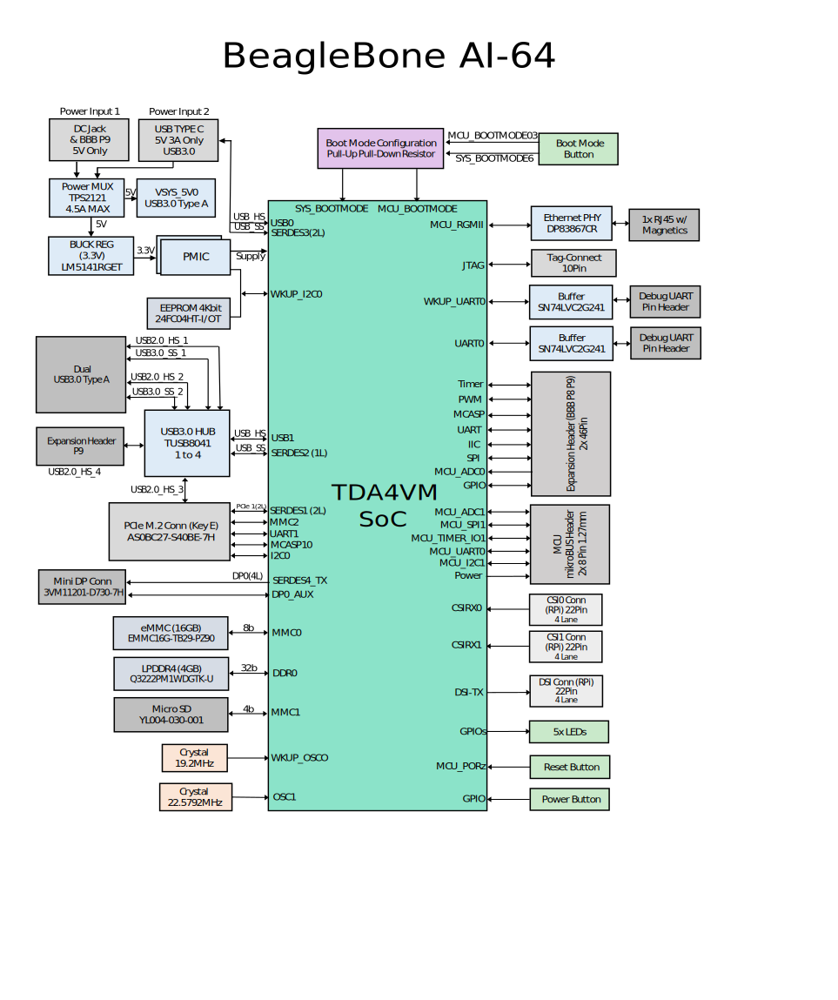

[[detailed-hardware-design]]
== Detailed Hardware Design

This section provides a detailed description of the Hardware design.
This can be useful for interfacing, writing drivers, or using it to help
modify specifics of your own design.

<<bbai-64-block-diagram-ch06>> below is the high level block diagram of the board. For
those who may be concerned, It is the same figure as shown in <<beaglebone-ai-64-high-level-specification>>.
It is placed here again for convenience so it is closer to the topics to follow.

[[bbai-64-block-diagram-ch06,BeagleBone AI-64 Key Components figure]]

[[power-section]]
=== Power Section

<<power-flow-diagram>> shows the high level block diagram of the power section of the
board.

[[power-flow-diagram,High level power block diagram]]

This section describes the power section of the design and all the
functions performed by the *TPS65941213 and TPS65941111*.

[[TPS65941213-and-TPS65941111-pmic]]
==== TPS65941213 and TPS65941111 PMIC

The main Power Management IC (PMIC) in the system is the *TPS65941213 and TPS65941111*
which is a single chip power management IC consisting of a linear
dual-input power path, three step-down converters, and four LDOs. LDO
stands for Low Drop Out. If you want to know more about an LDO, you can
go to
http://en.wikipedia.org/wiki/Low-dropout_regulator[_http://en.wikipedia.org/wiki/Low-dropout_regulator_.]
If you want to learn more about step-down converters, you can go to
http://en.wikipedia.org/wiki/DC-to-DC_converter[_http://en.wikipedia.org/wiki/DC-to-DC_converter_]

The system is supplied by a USB port or DC adapter. Three
high-efficiency 2.25MHz step-down converters are targeted at providing
the core voltage, MPU, and memory voltage for the board.

The step-down converters enter a low power mode at light load for
maximum efficiency across the widest possible range of load currents.
For low-noise applications the devices can be forced into fixed
frequency PWM using the I2C interface. The step-down converters allow
the use of small inductors and capacitors to achieve a small footprint
solution size.

LDO1 and LDO2 are intended to support system standby mode. In normal
operation, they can support up to 100mA each. LDO3 and LDO4 can support
up to 285mA each.

By default only LDO1 is always ON but any rail can be configured to
remain up in SLEEP state. In particular the DCDC converters can remain
up in a low-power PFM mode to support processor suspend mode. The
*TPS65941213 and TPS65941111* offers flexible power-up and power-down sequencing and
several house-keeping functions such as power-good output, pushbutton
monitor, hardware reset function and temperature sensor to protect the
battery.

See the <<TPS6594-Q1-block-diagram>> shown below for high level details
for *TPS65941213 and TPS65941111*, for more information on the, refer to
https://www.ti.com/product/TPS6594-Q1 Texas instruments product page.

[[TPS6594-Q1-block-diagram,TPS6594-Q1 block diagram]]

[[pmic-a-diagram,PMIC-A TPS65941213 circuit]]

[[pmic-b-diagram,PMIC-B TPS65941111 circuit]]

[[dc-input]]
==== DC Input

<<figure-23>> below shows how the DC input is connected to
the **TPS65941213 and TPS65941111**.

[[figure-23,Figure 23]]
.Figure 23. TPS65217 DC Connection
image:media/image38.png[media/image38.png,title="media/image38.png",width=458,height=408]

A 5VDC supply can be used to provide power to the board. The power
supply current depends on how many and what type of add-on boards are
connected to the board. For typical use, a 5VDC supply rated at 1A
should be sufficient. If heavier use of the expansion headers or USB
host port is expected, then a higher current supply will be required.

The connector used is a 2.1MM center positive x 5.5mm outer barrel. The
5VDC rail is connected to the expansion header. It is possible to power
the board via the expansion headers from an add-on card. The 5VDC is
also available for use by the add-on cards when the power is supplied by
the 5VDC jack on the board.

[[usb-power]]
==== USB Power

The board can also be powered from the USB port. A typical USB port is
limited to 500mA max. When powering from the USB port, the VDD_5V rail
is not provided to the expansion headers, so capes that require the 5V
rail to supply the cape direct, bypassing the *TPS65941213 and TPS65941111*, will not have
that rail available for use. The 5VDC supply from the USB port is
provided on the SYS_5V, the one that comes from the**TPS65941213 and TPS65941111**, rail
of the expansion header for use by a cape. *Figure 24* is the connection
of the USB power input on the PMIC.

[[figure-24.-usb-power-connections]]
.Figure 24. USB Power Connections
image:media/image96.png[media/image96.png,title="media/image96.png",width=519,height=622]

[[power-selection]]
==== Power Selection

The selection of either the 5VDC or the USB as the power source is
handled internally to the *TPS65941213 and TPS65941111* and automatically switches to 5VDC
power if both are connected. SW can change the power configuration via
the I2C interface from the processor. In addition, the SW can read
the**TPS65941213 and TPS65941111** and determine if the board is running on the 5VDC input
or the USB input. This can be beneficial to know the capability of the
board to supply current for things like operating frequency and
expansion cards.

It is possible to power the board from the USB input and then connect
the DC power supply. The board will switch over automatically to the DC
input.

[[power-button-1]]
==== Power Button

A power button is connected to the input of the *TPS65941213 and TPS65941111*. This is a
momentary switch, the same type of switch used for reset and boot
selection on the board.

If you push the button the *TPS65941213 and TPS65941111* will send an interrupt to the
processor. It is up to the processor to then pull the**PMIC_POWER_EN**
pin low at the correct time to power down the board. At this point, the
PMIC is still active, assuming that the power input was not removed.
Pressing the power button will cause the board to power up again if the
processor puts the board in the power off mode.

In power off mode, the RTC rail is still active, keeping the RTC powered
and running off the main power input. If you remove that power, then the
RTC will not be powered. You also have the option of using the battery
holes on the board to connect a battery if desired as discussed in the
next section.

If you push and hold the button for greater than 8 seconds, the PMIC
will power down. But you must release the button when the power LED
turns off. Holding the button past that point will cause the board to
power cycle.

[[battery-access-pads]]
==== Battery Access Pads

Four pads are provided on the board to allow access to the battery pins
on the *TPS65941213 and TPS65941111*. The pads can be loaded with a 4x4 header or you may
just wire a battery into the pads. In addition they could provide access
via a cape if desired. The four signals are listed below in <<table-3>>.

[[table-3,Table 3]]
.Table 3. BeagleBone AI-64 Battery Pins
[cols="1h,2,6",options="header",]
|=======================================================================
|*PIN* |*DESIGNATION* |*FUNCTION*
|*BAT* |TP5 |Battery connection point.

|*SENSE* |TP6 |Battery voltage sense input, connect to BAT directly at
the battery terminal.

|*TS* |TP7 |Temperature sense input. Connect to NTC thermistor to sense
battery temperature.

|*GND* |TP8 |System ground.
|=======================================================================

There is no fuel gauge function provided by the *TPS65941213 and TPS65941111*. That would
need to be added if that function was required. If you want to add a
fuel gauge, and option is to use 1-wire SPI or I2C device. You will need
to add this using the expansion headers and place it on an expansion
board.

*NOTE: Refer to the TPS65941213 and TPS65941111 documentation* +
*before connecting anything to these pins.*

[[section-6-1-7,Section 6.1.7 Power Consumption]]
==== Power Consumption

The power consumption of the board varies based on power scenarios and
the board boot processes. Measurements were taken with the board in the
following configuration:

* DC powered and USB powered
*  monitor connected
* USB HUB
* 4GB Thumbdrive
* Ethernet connected @ 100M
* Serial debug cable connected

<<table-4>> is an analysis of the power consumption of the board in these
various scenarios.

[[table-4,Table 4]]
.Table 4. BeagleBone AI-64 Power Consumption(mA@5V)
[cols="4h,1,1,1",options="header",]
|============================================
|*MODE* |*USB* |*DC* |*DC+USB*
|*Reset* |TBD |TBD |TBD
|*Idling @ UBoot* |210 |210 |210
|*Kernel Booting (Peak)* |460 |460 |460
|*Kernel Idling* |350 |350 |350
|*Kernel Idling Display Blank* |280 |280 |280
|*Loading a Webpage* |430 |430 |430
|============================================

The current will fluctuate as various activates occur, such as the LEDs
on and microSD/eMMC accesses.

[[processor-interfaces]]
==== Processor Interfaces

The processor interacts with the *TPS65941213 and TPS65941111* via several different
signals. Each of these signals is described below.

[[i2c0]]
===== I2C0

I2C0 is the control interface between the processor and the *TPS65941213 and TPS65941111*.
It allows the processor to control the registers inside the**TPS65941213 and TPS65941111**
for such things as voltage scaling and switching of the input rails.

[[pmc_powr_en]]
===== PMIC_POWR_EN

On power up the *VDD_RTC* rail activates first. After the RTC circuitry
in the processor has activated it instructs the**TPS65941213 and TPS65941111** to initiate
a full power up cycle by activating the *PMIC_POWR_EN* signal by taking
it HI. When powering down, the processor can take this pin low to start
the power down process.

[[ldo_good]]
===== LDO_GOOD

This signal connects to the *RTC_PORZn* signal, RTC power on reset. The
small “*n*” indicates that the signal is an active low signal. Word
processors seem to be unable to put a bar over a word so the**n** is
commonly used in electronics. As the RTC circuitry comes up first, this
signal indicates that the LDOs, the 1.8V VRTC rail, is up and stable.
This starts the power up process.

[[pmic_pgood]]
===== PMIC_PGOOD

Once all the rails are up, the *PMIC_PGOOD* signal goes high. This
releases the**PORZn** signal on the processor which was holding the
processor reset.

[[wakeup]]
===== WAKEUP

The WAKEUP signal from the *TPS65941213 and TPS65941111* is connected to the**EXT_WAKEUP**
signal on the processor. This is used to wake up the processor when it
is in a sleep mode. When an event is detected by the *TPS65941213 and TPS65941111*, such
as the power button being pressed, it generates this signal.

[[pmic_int]]
===== PMIC_INT

The *PMIC_INT* signal is an interrupt signal to the processor. Pressing
the power button will send an interrupt to the processor allowing it to
implement a power down mode in an orderly fashion, go into sleep mode,
or cause it to wake up from a sleep mode. All of these require SW
support.

[[power-rails]]
==== 6.1.9 Power Rails

<<figure-25>> shows the connections of each of the rails from
the **TPS65941213 and TPS65941111**.

[[figure-25,Figure 25]]
.Figure 25. Power Rails
image:media/image39.jpg[media/image39.jpg,title="media/image39.jpg",width=562,height=505]

===== VRTC Rail

The *VRTC* rail is a 1.8V rail that is the first rail to come up in the
power sequencing. It provides power to the RTC domain on the processor
and the I/O rail of the **TPS65941213 and TPS65941111**. It can deliver up to 250mA
maximum.

===== VDD_3V3A Rail

The *VDD_3V3A* rail is supplied by the **TPS65941213 and TPS65941111** and provides the
3.3V for the processor rails and can provide up to 400mA.

===== VDD_3V3B Rail

The current supplied by the *VDD_3V3A* rail is not sufficient to power
all of the 3.3V rails on the board. So a second LDO is supplied, U4,
a**TL5209A**, which sources the *VDD_3V3B* rail. It is powered up just
after the *VDD_3V3A* rail.

===== VDD_1V8 Rail

The *VDD_1V8* rail can deliver up to 400mA and provides the power
required for the 1.8V rails on the processor and the display framer. This
rail is not accessible for use anywhere else on the board.

===== VDD_CORE Rail

The *VDD_CORE* rail can deliver up to 1.2A at 1.1V. This rail is not
accessible for use anywhere else on the board and connects only to the
processor. This rail is fixed at 1.1V and should not be adjusted by SW
using the PMIC. If you do, then the processor will no longer work.

===== VDD_MPU Rail

The *VDD_MPU* rail can deliver up to 1.2A. This rail is not accessible
for use anywhere else on the board and connects only to the processor.
This rail defaults to 1.1V and can be scaled up to allow for higher
frequency operation. Changing of the voltage is set via the I2C
interface from the processor.

===== VDDS_DDR Rail

The *VDDS_DDR* rail defaults to**1.5V** to support the LPDDR4 rails and
can deliver up to 1.2A. It is possible to adjust this voltage rail down
to *1.35V* for lower power operation of the LPDDR4 device. Only LPDDR4
devices can support this voltage setting of 1.35V.

===== Power Sequencing

The power up process is consists of several stages and events. <<figure-26>>
describes the events that make up the power up process for the
processer from the PMIC. This diagram is used elsewhere to convey
additional information. I saw no need to bust it up into smaller
diagrams. It is from the processor datasheet supplied by Texas
Instruments.

[[figure-26,Figure 26]]
.Figure 26. Power Rail Power Up Sequencing
image:media/image40.png[media/image40.png,title="media/image40.png",width=547,height=397]

<<figure-27>> the voltage rail sequencing for the**TPS65941213 and TPS65941111** as it
powers up and the voltages on each rail. The power sequencing starts at
15 and then goes to one. That is the way the *TPS65941213 and TPS65941111* is configured.
You can refer to the TPS65941213 and TPS65941111 datasheet for more information.

[[figure-27,Figure 27]]
.Figure 27. TPS65941213 and TPS65941111 Power Sequencing Timing
image:media/image41.png[media/image41.png,title="media/image41.png",width=225,height=188]

[[power-led]]
==== Power LED

The power LED is a blue LED that will turn on once the *TPS65941213 and TPS65941111* has
finished the power up procedure. If you ever see the LED flash once,
that means that the**TPS65941213 and TPS65941111** started the process and encountered an
issue that caused it to shut down. The connection of the LED is shown in
<<figure-25>>.

[[TPS65941213-and-TPS65941111-power-up-process]]
==== TPS65941213 and TPS65941111 Power Up Process

<<figure-28>> shows the interface between the **TPS65941213 and TPS65941111** and the
processor. It is a cut from the PDF form of the schematic and reflects
what is on the schematic.

[[figure-28,Figure 28]]
.Figure 28. Power Processor Interfaces
image:media/image42.jpg[media/image42.jpg,title="media/image42.jpg",width=575,height=185]

When voltage is applied, DC or USB, the *TPS65941213 and TPS65941111* connects the power
to the SYS output pin which drives the switchers and LDOs in
the **TPS65941213 and TPS65941111**.

At power up all switchers and LDOs are off except for the *VRTC LDO*
(1.8V), which provides power to the VRTC rail and controls
the **RTC_PORZn** input pin to the processor, which starts the power up
process of the processor. Once the RTC rail powers up, the *RTC_PORZn*
pin, driven by the *LDO_PGOOD* signal from the *TPS65941213 and TPS65941111*, of the
processor is released.

Once the *RTC_PORZn* reset is released, the processor starts the
initialization process. After the RTC stabilizes, the processor launches
the rest of the power up process by activating the**PMIC_POWER_EN**
signal that is connected to the *TPS65941213 and TPS65941111* which starts the *TPS65941213 and TPS65941111*
power up process.

The *LDO_PGOOD* signal is provided by the**TPS65941213 and TPS65941111** to the processor.
As this signal is 1.8V from the *TPS65941213 and TPS65941111* by virtue of the *TPS65941213 and TPS65941111*
VIO rail being set to 1.8V, and the *RTC_PORZ* signal on the processor
is 3.3V, a voltage level shifter, *U4*, is used. Once the LDOs and
switchers are up on the *TPS65941213 and TPS65941111*, this signal goes active releasing
the processor. The LDOs on the *TPS65941213 and TPS65941111* are used to power the VRTC
rail on the processor.

[[processor-control-interface]]
==== Processor Control Interface

<<figure-28>> above shows two interfaces between the processor and
the**TPS65941213 and TPS65941111** used for control after the power up sequence has
completed.

The first is the *I2C0* bus. This allows the processor to turn on and
off rails and to set the voltage levels of each regulator to supports
such things as voltage scaling.

The second is the interrupt signal. This allows the *TPS65941213 and TPS65941111* to alert
the processor when there is an event, such as when the power button is
pressed. The interrupt is an open drain output which makes it easy to
interface to 3.3V of the processor.

[[low-power-mode-support]]
==== Low Power Mode Support

This section covers three general power down modes that are available.
These modes are only described from a Hardware perspective as it relates
to the HW design.

===== RTC Only

In this mode all rails are turned off except the *VDD_RTC*. The
processor will need to turn off all the rails to enter this mode.
The**VDD_RTC** staying on will keep the RTC active and provide for the
wakeup interfaces to be active to respond to a wake up event.

===== RTC Plus DDR

In this mode all rails are turned off except the *VDD_RTC* and
the**VDDS_DDR**, which powers the LPDDR4 memory. The processor will need
to turn off all the rails to enter this mode. The *VDD_RTC* staying on
will keep the RTC active and provide for the wakeup interfaces to be
active to respond to a wake up event.

The *VDDS_DDR* rail to the LPDDR4 is provided by the 1.5V rail of
the **TPS65941213 and TPS65941111** and with *VDDS_DDR* active, the LPDDR4 can be placed in
a self refresh mode by the processor prior to power down which allows
the memory data to be saved.

Currently, this feature is not included in the standard software
release. The plan is to include it in future releases.

===== Voltage Scaling

For a mode where the lowest power is possible without going to sleep,
this mode allows the voltage on the ARM processor to be lowered along
with slowing the processor frequency down. The I2C0 bus is used to
control the voltage scaling function in the *TPS65941213 and TPS65941111*.

[[sitara-am3358bzcz100-processor]]
=== TI J721E DRA829/TDA4VM/AM752x Processor

The board is designed to use the TI J721E DRA829/TDA4VM/AM752x processor in the
15 x 15 package. 

[[description]]
==== Description

<<figure-29>> is a high level block diagram of the processor. For more
information on the processor, go to
https://www.ti.com/product/TDA4VM[_https://www.ti.com/product/TDA4VM_.]

[[figure-29,Figure 29]]
.Figure 29. Jacinto TDA4VMBZCZ Block Diagram
image:media/image43.png[media/image43.png,title="media/image43.png",width=503,height=511,align="center"]

[[high-level-features]]
==== High Level Features

<<table-5>> below shows a few of the high level features of the Jacinto
processor.

[[table-5,Table 5]]
.Table 5. Processor Features
[cols="4h,5,2h,3",]
|=======================================================================
|Operating Systems |Linux, Android, Windows Embedded CE,QNX, +
ThreadX |MMC/SD |3

|Standby Power |7 mW |CAN |2

|ARM CPU |1 ARM Cortex-A8 |UART (SCI) |6

|ARM MHz (Max.) |275,500,600,800,1000 |ADC |8-ch 12-bit

|ARM MIPS (Max.) |1000,1200,2000 |PWM (Ch) |3

|Graphics Acceleration |1 3D |eCAP |3

|Other Hardware Acceleration |2 PRU-ICSS,Crypto +
Accelerator |eQEP |3

|On-Chip L1 Cache |64 KB (ARM Cortex-A8) |RTC |1

|On-Chip L2 Cache |256 KB (ARM Cortex- +
A8) |I2C |3

|Other On-Chip Memory |128 KB |McASP |2

|Display Options |LCD |SPI |2

|General Purpose Memory |1 16-bit (GPMC, NAND flash, NOR Flash, SRAM)
|DMA (Ch) |64-Ch EDMA

|DRAM |1 16-bit (LPDDR-400, +
DDR2-532, DDR3-400) |IO Supply (V) |1.8V(ADC),3.3V

|USB Ports |2 |Operating +
Temperature Range (C) |-40 to 90
|=======================================================================

[[documentation]]
==== Documentation

Full documentation for the processor can be found on the TI website at
https://www.ti.com/product/TDA4VM[_https://www.ti.com/product/TDA4VM_] for
the current processor used on the board. Make sure that you always use
the latest datasheets and Technical Reference Manuals (TRM).

[[crystal-circuitry]]
==== Crystal Circuitry

<<figure-30>>is the crystal circuitry for the TDA4VM processor.

[[figure-30,Figure 30]]
.Figure 30. Processor Crystals
image:media/image44.png[media/image44.png,title="fig:media/image44.png",width=570,height=223,align="center"]

[[reset-circuitry]]
==== Reset Circuitry

<<figure-31>> is the board reset circuitry. The initial power on reset is
generated by the **TPS65941213 and TPS65941111** power management IC. It also handles the
reset for the Real Time Clock.

The board reset is the SYS_RESETn signal. This is connected to the
NRESET_INOUT pin of the processor. This pin can act as an input or an
output. When the reset button is pressed, it sends a warm reset to the
processor and to the system.

On the revision A5D board, a change was made. On power up, the
NRESET_INOUT signal can act as an output. In this instance it can cause
the SYS_RESETn line to go high prematurely. In order to prevent this,
the PORZn signal from the TPS65941213 and TPS65941111 is connected to the SYS_RESETn line
using an open drain buffer. These ensure that the line does not
momentarily go high on power up.

[[figure-31,Figure 31]]
.Figure 31. Board Reset Circuitry
image:media/image45.png[media/image45.png,title="media/image45.png",width=568,height=333,align="center"]

This change is also in all revisions after A5D.

LPDDR4 Memory

The BeagleBone AI-64 uses a single MT41K256M16HA-125 512MB LPDDR4 device
from Micron that interfaces to the processor over 16 data lines, 16
address lines, and 14 control lines. On rev C we added the Kingston
*KE4CN2H5A-A58* device as a source for the LPDDR4 device**.**

The following sections provide more details on the design.

[[memory-device]]
==== Memory Device

The design supports the standard DDR3 and LPDDR4 x16 devices and is built
using the LPDDR4. A single x16 device is used on the board and there is
no support for two x8 devices. The DDR3 devices work at 1.5V and the
LPDDR4 devices can work down to

1.35V to achieve lower power. The LPDDR4 comes in a 96-BALL FBGA package
with 0.8 mil pitch. Other standard DDR3 devices can also be supported,
but the LPDDR4 is the lower power device and was chosen for its ability
to work at 1.5V or 1.35V. The standard frequency that the LPDDR4 is run
at on the board is 400MHZ.

[[ddr3l-memory-design]]
==== LPDDR4 Memory Design

<<figure-32>> is the schematic for the LPDDR4 memory device. Each of the
groups of signals is described in the following lines.

_Address Lines:_ Provide the row address for ACTIVATE commands, and the
column address and auto pre-charge bit (A10) for READ/WRITE commands, to
select one location out of the memory array in the respective bank. A10
sampled during a 
PRECHARGE command determines whether the PRECHARGE applies to one bank
(A10 LOW, bank selected by BA[2:0]) or all banks (A10 HIGH). The address
inputs also provide the op-code during a LOAD MODE command. Address
inputs are referenced to VREFCA. A12/BC#: When enabled in the mode
register (MR), A12 is sampled during READ and WRITE commands to
determine whether burst chop (on-the-fly) will be performed (HIGH = BL8
or no burst chop, LOW = BC4 burst chop).

_Bank Address Lines:_ BA[2:0] define the bank to which an ACTIVATE,
READ, WRITE, or PRECHARGE command is being applied. BA[2:0] define which
mode register (MR0, MR1, MR2, or MR3) is loaded during the LOAD MODE
command. BA[2:0] are referenced to VREFCA.

_CK and CK# Lines:_ are differential clock inputs. All address and
control input signals are sampled on the crossing of the positive edge
of CK and the negative edge of CK#. Output data strobe (DQS, DQS#) is
referenced to the crossings of CK and CK#.

_Clock Enable Line:_ CKE enables (registered HIGH) and disables
(registered LOW) internal circuitry and clocks on the DRAM. The specific
circuitry that is enabled/disabled is dependent upon the DDR3 SDRAM
configuration and operating mode. Taking CKE LOW provides PRECHARGE
power-down and SELF REFRESH operations (all banks idle) or active
power-down (row active in any bank). CKE is synchronous for powerdown
entry and exit and for self refresh entry. CKE is asynchronous for self
refresh exit. Input buffers (excluding CK, CK#, CKE, RESET#, and ODT)
are disabled during powerdown. Input buffers (excluding CKE and RESET#)
are disabled during SELF REFRESH. CKE is referenced to VREFCA.

[[figure-32,Figure 32]]
.Figure 32. LPDDR4 Memory Design
image:media/image46.png[media/image46.png,title="media/image46.png",width=566,height=525,align="center"]

_Chip Select Line:_ CS# enables (registered LOW) and disables
(registered HIGH) the command decoder. All commands are masked when CS#
is registered HIGH. CS# provides for external rank selection on systems
with multiple ranks. CS# is considered part of the command code. CS# is
referenced to VREFCA.

_Input Data Mask Line:_ DM is an input mask signal for write data. Input
data is masked when DM is sampled HIGH along with the input data during
a write access. Although the DM ball is input-only, the DM loading is
designed to match that of the DQ and DQS balls. DM is referenced to
VREFDQ.

_On-die Termination Line:_ ODT enables (registered HIGH) and disables
(registered LOW) termination resistance internal to the LPDDR4 SDRAM.
When enabled in normal operation, ODT is only applied to each of the
following balls: DQ[7:0], DQS, DQS#, and DM for the x8; DQ[3:0], DQS,
DQS#, and DM for the x4. The ODT input is ignored if disabled via the
LOAD MODE command. ODT is referenced to VREFCA.

[[power-rails-1]]
==== Power Rails

The *LPDDR4* memory device and the DDR3 rails on the processor are
supplied by the**TPS65941213 and TPS65941111**. Default voltage is 1.5V but can be scaled
down to 1.35V if desired.

[[vref]]
==== VREF

The *VREF* signal is generated from a voltage divider on the**VDDS_DDR**
rail that powers the processor DDR rail and the LPDDR4 device itself.
*Figure 33* below shows the configuration of this signal and the
connection to the LPDDR4 memory device and the processor.

[[figure-33,Figure 33]]
.Figure 33. LPDDR4 VREF Design*
image:media/image47.jpg[media/image47.jpg,title="media/image47.jpg",width=376,height=269,align="center"]

[[gb-emmc-memory]]
=== 4GB eMMC Memory

The eMMC is a communication and mass data storage device that includes a
Multi-MediaCard (MMC) interface, a NAND Flash component, and a
controller on an advanced 11-signal bus, which is compliant with the MMC
system specification. The nonvolatile eMMC draws no power to maintain
stored data, delivers high performance across a wide range of operating
temperatures, and resists shock and vibration disruption.

One of the issues faced with SD cards is that across the different
brands and even within the same brand, performance can vary. Cards use
different controllers and different memories, all of which can have bad
locations that the controller handles. But the controllers may be
optimized for reads or writes. You never know what you will be getting.
This can lead to varying rates of performance. The eMMC card is a known
controller and when coupled with the 8bit mode, 8 bits of data instead
of 4, you get double the performance which should result in quicker boot
times.

The following sections describe the design and device that is used on
the board to implement this interface.

[[emmc-device]]
==== eMMC Device

The device used is one of two different devices:

* Micron *MTFC4GLDEA 0M WT*
* Kingston *KE4CN2H5A-A58*

The package is a 153 ball WFBGA device on both devices.

[[emmc-circuit-design]]
==== eMMC Circuit Design

<<figure-34>> is the design of the eMMC circuitry. The eMMC device is
connected to the MMC1 port on the processor. MMC0 is still used for the
microSD card as is currently done on the original BeagleBone. The size
of the eMMC supplied is now 4GB.

The device runs at 3.3V both internally and the external I/O rails. The
VCCI is an internal voltage rail to the device. The manufacturer
recommends that a 1uF capacitor be attached to this rail, but a 2.2uF
was chosen to provide a little margin.

Pullup resistors are used to increase the rise time on the signals to
compensate for any capacitance on the board.

[[figure-34,Figure 34]]
.Figure 34. eMMC Memory Design
image:media/image48.png[media/image48.png,title="media/image48.png",width=542,height=224,align="center"]

The pins used by the eMMC1 in the boot mode are listed below in *Table
6*.

[[table-6,Table 6]]
.Table 6. eMMC Boot Pins
image:media/image49.png[media/image49.png,title="media/image49.png",width=528,height=112,align="center"]

For eMMC devices the ROM will only support raw mode. The ROM Code reads
out raw sectors from image or the booting file within the file system
and boots from it. In raw mode the booting image can be located at one
of the four consecutive locations in the main area: offset 0x0 / 0x20000
(128 KB) / 0x40000 (256 KB) / 0x60000 (384 KB). For this reason, a
booting image shall not exceed 128KB in size. However it is possible to
flash a device with an image greater than 128KB starting at one of the
aforementioned locations. Therefore the ROM Code does not check the
image size. The only drawback is that the image will cross the
subsequent image boundary. The raw mode is detected by reading sectors
#0, #256, #512, #768. The content of these sectors is then verified for
presence of a TOC structure. In the case of a *GP Device*, a
Configuration Header (CH)*must* be located in the first sector followed
by a *GP header*. The CH might be void (only containing a CHSETTINGS
item for which the Valid field is zero).

The ROM only supports the 4-bit mode. After the initial boot, the switch
can be made to 8-bit mode for increasing the overall performance of the
eMMC interface.

[[board-id-eeprom]]
=== Board ID EEPROM

The BeagleBone is equipped with a single 32Kbit(4KB) 24LC32AT-I/OT
EEPROM to allow the SW to identify the board. *Table 7* below defined
the contents of the EEPROM.

[[table-7,Table 7]]
.Table 7. EEPROM Contents
[cols="3,1,3",options="header",]
|=======================================================================
|*Name* |*Size (bytes)* |*Contents*
|*Header* |*4* |*0xAA, 0x55, 0x33, EE*

|*Board Name* |*8* |*Name for board in ASCII: A335BNLT*

|*Version* |*4* |*Hardware version code for board in ASCII:* +
*00A3 for Rev A3, 00A4 for Rev A4, 00A5 for Rev A5,* +
*00A6 for Rev A6,00B0 for Rev B, and 00C0 for Rev C.*

|*Serial Number* |*12* |*Serial number of the board. This is a 12
character string which is:* +
*WWYY4P16nnnn* +
*where: WW = 2 digit week of the year of production* +
*YY = 2 digit year of production* +
*BBBK = BeagleBone AI-64 nnnn = incrementing board number*

|*Configuration Option* |*32* |*Codes to show the configuration setup on
this board.* +
*All FF*

|*RSVD* |*6* |*FF FF FF FF FF FF*

|*RSVD* |*6* |*FF FF FF FF FF FF*

|*RSVD* |*6* |*FF FF FF FF FF FF*

|*Available* |*4018* |*Available space for other non-volatile
codes/data*
|=======================================================================

<<figure-35>> shows the new design on the EEPROM interface.

[[figure-35,Figure 35]]
.Figure 35. EEPROM Design Rev A5
image:media/image50.png[media/image50.png,title="media/image50.png",width=473,height=194,align="center"]

The EEPROM is accessed by the processor using the I2C 0 bus. The *WP*
pin is enabled by default. By grounding the test point, the write
protection is removed.

The first 48 locations should not be written to if you choose to use the
extras storage space in the EEPROM for other purposes. If you do, it
could prevent the board from booting properly as the SW uses this
information to determine how to set up the board.

[[micro-secure-digital]]
=== Micro Secure Digital

The microSD connector on the board will support a microSD card that can
be used for booting or file storage on BeagleBone AI-64.

[[microsd-design]]
==== microSD Design

<<figure-36>> below is the design of the microSD interface on the board.

[[figure-36,Figure 36]]
.Figure 36. microSD Design
image:media/image51.png[media/image51.png,title="media/image51.png",width=550,height=216,align="center"]

The signals *MMC0-3* are the data lines for the transfer of data between
the processor and the microSD connector.

The *MMC0_CLK* signal clocks the data in and out of the microSD card.

The *MMCO_CMD* signal indicates that a command versus data is being
sent.

There is no separate card detect pin in the microSD specification. It
uses *MMCO_DAT3* for that function. However, most microSD connectors
still supply a CD function on the connectors. In BeagleBone AI-64
design, this pin is connected to the**MMC0_SDCD** pin for use by the
processor. You can also change the pin to *GPIO0_6*, which is able to
wake up the processor from a sleep mode when an microSD card is inserted
into the connector.

Pullup resistors are provided on the signals to increase the rise times
of the signals to overcome PCB capacitance.

Power is provided from the *VDD_3V3B* rail and a 10uF capacitor is
provided for filtering.

[[user-leds]]
=== User LEDs

There are four user LEDs on BeagleBone AI-64. These are connected to
GPIO pins on the processor. *Figure 37* shows the interfaces for the
user LEDs.

[[figure-37,Figure 37]]
.Figure 37. User LEDs
image:media/image52.png[media/image52.png,title="media/image52.png",width=570,height=290,align="center"]

Resistors R71-R74 were changed to 4.75K on the revision A5B and later
boards.

<<table-8>> shows the signals used to control the four LEDs from the
processor.

[[table-8,Table 8]]
.Table 8. User LED Control Signals/Pins
[cols=",,",options="header",]
|================================
|*LED* |*GPIO SIGNAL* |*PROC PIN*
|USR0 |GPIO1_21 |V15
|USR1 |GPIO1_22 |U15
|USR2 |GPIO1_23 |T15
|USR3 |GPIO1_24 |V16
|================================

A logic level of “1” will cause the LEDs to turn on.

[[boot-configuration]]
=== Boot Configuration

The design supports two groups of boot options on the board. The user
can switch between these modes via the Boot button. The primary boot
source is the onboard eMMC device. By holding the Boot button, the user
can force the board to boot from the microSD slot. This enables the eMMC
to be overwritten when needed or to just boot an alternate image. The
following sections describe how the boot configuration works.

In most applications, including those that use the provided demo
distributions available from http://beagleboard.org/[_beagleboard.org_,]
the processor-external boot code is composed of two stages. After the
primary boot code in the processor ROM passes control, a secondary stage
(secondary program loader -- "SPL" or "MLO") takes over. The SPL stage
initializes only the required devices to continue the boot process, and
then control is transferred to the third stage "U-boot". Based on the
settings of the boot pins, the ROM knows where to go and get the SPL and
UBoot code. In the case of BeagleBone AI-64, that is either eMMC or
microSD based on the position of the boot switch.

[[boot-configuration-design]]
==== Boot Configuration Design

<<figure-38>> shows the circuitry that is involved in the boot
configuration process. On power up, these pins are read by the processor
to determine the boot order. S2 is used to change the level of one bit
from HI to LO which changes the boot order.

[[figure-38,Figure 38]]
.Figure 38. Processor Boot Configuration Design
image:media/image53.png[media/image53.png,title="media/image53.png",width=448,height=367,align="center"]

It is possible to override these setting via the expansion headers. But
be careful not to add too much load such that it could interfere with
the operation of the display interface or LCD panels. If you choose to
override these settings, it is strongly recommended that you gate these
signals with the *SYS_RESETn* signal. This ensures that after coming out
of reset these signals are removed from the expansion pins.

[[default-boot-options]]
=== Default Boot Options

Based on the selected option found in <<figure-39>> below, each of the
boot sequences for each of the two settings is shown.

[[figure-39,Figure 39]]
.Figure 39. Processor Boot Configuration
image:media/image54.jpg[media/image54.jpg,title="media/image54.jpg",width=601,height=130,align="center"]

The first row in <<figure-39>> is the default setting. On boot, the
processor will look for the eMMC on the MMC1 port first, followed by the
microSD slot on MMC0, USB0 and UART0. In the event there is no microSD
card and the eMMC is empty, UART0 or USB0 could be used as the board
source.

If you have a microSD card from which you need to boot from, hold the
boot button down. On boot, the processor will look for the SPIO0 port
first, then microSD on the MMC0 port, followed by USB0 and UART0. In the
event there is no microSD card and the eMMC is empty, USB0 or UART0
could be used as the board source.

[[ethernet]]
=== 10/100 Ethernet

The BeagleBone AI-64 is equipped with a 10/100 Ethernet interface. It
uses the same PHY as is used on the original BeagleBone. The design is
described in the following sections.

[[ethernet-processor-interface]]
==== Ethernet Processor Interface

<<figure-40>> shows the connections between the processor and the PHY. The
interface is in the MII mode of operation.

[[figure-40,Figure 40]]
.Figure 40. Ethernet Processor Interface
image:media/image55.png[media/image55.png,title="media/image55.png",width=448,height=312,align="center"]

This is the same interface as is used on BeagleBone. No changes were
made in this design for the board.

[[ethernet-connector-interface]]
==== Ethernet Connector Interface

The off board side of the PHY connections are shown in *Figure 41*
below.

[[figure-41,Figure 41]]
.Figure 41. Ethernet Connector Interface
image:media/image56.png[media/image56.png,title="media/image56.png",width=570,height=347,align="center"]

This is the same interface as is used on BeagleBone. No changes were
made in this design for the board.

[[ethernet-phy-power-reset-and-clocks]]
==== Ethernet PHY Power, Reset, and Clocks

<<figure-42>> shows the power, reset, and lock connections to
the **LAN8710A** PHY. Each of these areas is discussed in more detail in
the following sections.

[[figure-42,Figure 42]]
.Figure 42. Ethernet PHY, Power, Reset, and Clocks
image:media/image57.png[media/image57.png,title="media/image57.png",width=570,height=367,align="center"]

===== VDD_3V3B Rail

The VDD_3V3B rail is the main power rail for the *LAN8710A*. It
originates at the VD_3V3B regulator and is the primary rail that
supports all of the peripherals on the board. This rail also supplies
the VDDIO rails which set the voltage levels for all of the I/O signals
between the processor and the**LAN8710A**.

===== VDD_PHYA Rail

A filtered version of VDD_3V3B rail is connected to the VDD rails of the
LAN8710 and the termination resistors on the Ethernet signals. It is
labeled as *VDD_PHYA*. The filtering inductor helps block transients
that may be seen on the VDD_3V3B rail.

===== PHY_VDDCR Rail

The *PHY_VDDCR* rail originates inside the LAN8710A. Filter and bypass
capacitors are used to filter the rail. Only circuitry inside the
LAN8710A uses this rail.

===== SYS_RESET

The reset of the LAN8710A is controlled via the *SYS_RESETn* signal, the
main board reset line.

===== Clock Signals

A crystal is used to create the clock for the LAN8710A. The processor
uses the *RMII_RXCLK* signal to provide the clocking for the data
between the processor and the LAN8710A.

[[lan8710a-mode-pins]]
==== LAN8710A Mode Pins

There are mode pins on the LAN8710A that sets the operational mode for
the PHY when coming out of reset. These signals are also used to
communicate between the processor and the LAN8710A. As a result, these
signals can be driven by the processor which can cause the PHY not to be
initialized correctly. To ensure that this does not happen, three low
value pull up resistors are used. *Figure 43* below shows the three mode
pin resistors.

[[figure-43,Figure 43]]
.Figure 43. Ethernet PHY Mode Pins
image:media/image97.png[media/image97.png,title="media/image97.png",width=386,height=349,align="center"]

This will set the mode to be 111, which enables all modes and enables
auto-negotiation.

[[hdmi-interface-1]]
=== Display Port Interface

The BeagleBone AI-64 has an onboard Display Port framer that converts the LCD
signals and audio signals to drive a Display Port monitor. The design uses the on chip
internal Display Port Framer.

The following sections provide more detail into the design of this
interface.

[[supported-resolutions]]
==== Supported Resolutions

The maximum resolution supported by BeagleBone AI-64 is 1280x1024 @
60Hz. *Table 9* below shows the supported resolutions. Not all
resolutions may work on all monitors, but these have been tested and
shown to work on at least one monitor. EDID is supported on the
BeagleBone AI-64. Based on the EDID reading from the connected monitor,
the highest compatible resolution is selected.

.Table 9. HDMI Supported Monitor Adapter  Resolutions
[cols="4,1",options="header",]
|=======================
|RESOLUTION |AUDIO
|800 x 600 @60Hz | 
|800 x 600 @56Hz | 
|640 x 480 @75Hz | 
|640 x 480 @60Hz |YES 
|720 x 400 @70Hz | 
|1280 x 1024 @75Hz | 
|1024 x 768 @75Hz | 
|1024 x 768 @70Hz | 
|1024 x 768 @60Hz | 
|800 x 600 @75Hz | 
|800 x 600 @72Hz | 
|720 x 480 @60Hz |YES 
|1280 x 720 @60Hz |YES 
|1920x1080@24Hz |YES 
|=======================

NOTE: The updated software image used on the Rev A5B and later boards
added support for 1920x1080@24HZ.

Audio is limited to CEA supported resolutions. LCD panels only activate
the audio in CEA modes. This is a function of the specification and is
not something that can be fixed on the board via a hardware change or a
software change.

[[hdmi-framer]]
==== Display Port Framer

insert processor  Display Port framer doc here

[[hdmi-video-processor-interface]]
==== Display Port Video Processor Interface

insert processor  Display Port V-interface doc here

[[hdmi-control-processor-interface]]
==== Display Port Control Processor Interface

insert processor  Display Port C-interface doc here

[[interrupt-signal]]
==== Interrupt Signal

insert processor  Display Port interrupt doc here

[[audio-interface]]
==== Audio Interface

insert processor  Display Port audio doc here

[[power-connections]]
==== Power Connections

guesing this doesn’t exist on this device

[[hdmi-connector-interface]]
==== uDP Connector Interface

insert processor  Micro Display Port connector  doc here

[[usb-host]]
=== USB Host

The board is equipped with a single USB host interface accessible from a
single USB Type A female connector. <<figure-48>> is the design of the USB
Host circuitry.

[[figure-48,Figure 48]]
.Figure 48. USB Host circuit
image:media/image66.png[media/image66.png,title="media/image66.png",width=570,height=205,align="center"]

[[power-switch]]
==== Power Switch

*U8* is a switch that allows the power to the connector to be turned on
or off by the processor. It also has an over current detection that can
alert the processor if the current gets too high via the**USB1_OC**
signal. The power is controlled by the *USB1_DRVBUS* signal from the
processor.

[[esd-protection]]
==== ESD Protection

*U9* is the ESD protection for the signals that go to the connector.

[[filter-options]]
==== Filter Options

*FB7* and**FB8** were added to assist in passing the FCC emissions test.
The *USB1_VBUS* signal is used by the processor to detect that the 5V is
present on the connector. *FB7* is populated and *FB8* is replaced with
a .1 ohm resistor.

[[pru-icss]]
=== PRU-ICSS

The PRU-ICSS module is located inside the TDA4VM processor. Access to
these pins is provided by the expansion headers and is multiplexed with
other functions on the board. Access is not provided to all of the
available pins.

All documentation is located at
http://git.beagleboard.org/beagleboard/am335x_pru_package[_http://git.beagleboard.org/beagleboard/am335x_pru_package_.]
This feature is not supported by Texas Instruments.

[[pru-icss-features]]
==== PRU-ICSS Features

The features of the PRU-ICSS include:

Two independent programmable real-time (PRU) cores:

* 32-Bit Load/Store RISC architecture
* 8K Byte instruction RAM (2K instructions) per core
* 8K Bytes data RAM per core
* 12K Bytes shared RAM
* Operating frequency of 200 MHz
* PRU operation is little endian similar to ARM processor
* All memories within PRU-ICSS support parity
* Includes Interrupt Controller for system event handling
* Fast I/O interface

– 16 input pins and 16 output pins per PRU core. (Not all of these are
accessible on BeagleBone AI-64).

[[pru-icss-block-diagram]]
==== PRU-ICSS Block Diagram

<<figure-49>> is a high level block diagram of the PRU-ICSS.

[[figure-49,Figure 49]]
.Figure 49. PRU-ICSS Block Diagram
image:media/image67.png[media/image67.png,title="media/image67.png",width=427,height=275,align="center"]

[[pru-icss-pin-access]]
==== PRU-ICSS Pin Access

Both PRU 0 and PRU1 are accessible from the expansion headers. Some may
not be useable without first disabling functions on the board like LCD
for example. Listed below is what ports can be accessed on each PRU.

PRU0

* 8 outputs or 9 inputs

PRU1

* 13 outputs or 14 inputs
* UART0_TXD, UART0_RXD, UART0_CTS, UART0_RTS

<<table-11>> below shows which PRU-ICSS signals can be accessed on the
BeagleBone AI-64 and on which connector and pins they are accessible
from. Some signals are accessible on the same pins.

[[table-11,Table 11]]
.Table 11. PRU0 and PRU1 Access
|=======================================================================
| |*PIN* |*PROC* |*NAME* | | |
|P8 |11 |R12 |GPIO1_13 | |*pr1_pru0_pru_r30_15 (Output)* |
| |12 |T12 |GPIO1_12 | |*pr1_pru0_pru_r30_14 (Output)* |
| |15 |U13 |GPIO1_15 | |*pr1_pru0_pru_r31_15 (Input)* |
| |16 |V13 |GPIO1_14 | |*pr1_pru0_pru_r31_14 (Input)* | 
| |20 |V9 |GPIO1_31 |pr1_pru1_pru_r30_13 (Output) |pr1_pru1_pru_r31_13 (INPUT) | 
| |21 |U9 |GPIO1_30 |pr1_pru1_pru_r30_12 (Output) |pr1_pru1_pru_r31_12 (INPUT) | 
| |27 |U5 |GPIO2_22 |pr1_pru1_pru_r30_8 (Output) |pr1_pru1_pru_r31_8 (INPUT) | 
| |28 |V5 |GPIO2_24 |pr1_pru1_pru_r30_10 (Output) |pr1_pru1_pru_r31_10 (INPUT) |
| |29 |R5 |GPIO2_23 |pr1_pru1_pru_r30_9 (Output) |pr1_pru1_pru_r31_9 (INPUT) |
| |39 |T3 |GPIO2_12 |pr1_pru1_pru_r30_6 (Output) |pr1_pru1_pru_r31_6 (INPUT) |
| |40 |T4 |GPIO2_13 |pr1_pru1_pru_r30_7 (Output) |pr1_pru1_pru_r31_7 (INPUT) |
| |41 |T1 |GPIO2_10 |pr1_pru1_pru_r30_4 (Output) |pr1_pru1_pru_r31_4 (INPUT) |
| |42 |T2 |GPIO2_11 |pr1_pru1_pru_r30_5 (Output) |pr1_pru1_pru_r31_5 (INPUT) |
| |43 |R3 |GPIO2_8 |pr1_pru1_pru_r30_2 (Output) |pr1_pru1_pru_r31_2 (INPUT) |
| |44 |R4 |GPIO2_9 |pr1_pru1_pru_r30_3 (Output) |pr1_pru1_pru_r31_3 (INPUT) |
| |45 |R1 |GPIO2_6 |pr1_pru1_pru_r30_0 (Output) |pr1_pru1_pru_r31_0 (INPUT) |
| |46 |R2 |GPIO2_7 |pr1_pru1_pru_r30_1 (Output) |pr1_pru1_pru_r31_1 (INPUT) |
| | | | | | |
|P9 |17 |A16 |I2C1_SCL |pr1_uart0_txd | |
| |18 |B16 |I2C1_SDA |pr1_uart0_rxd | | 
| |19 |D17 |I2C2_SCL |pr1_uart0_rts_n | | 
| |20 |D18 |I2C2_SDA |pr1_uart0_cts_n | | 
| |21 |B17 |UART2_TXD |pr1_uart0_rts_n | | 
| |22 |A17 |UART2_RXD |pr1_uart0_cts_n | | 
| |24 |D15 |UART1_TXD |pr1_uart0_txd |*pr1_pru0_pru_r31_16 (Input)* |
| |25 |A14 |GPIO3_21footnote:[GPIO3_21 is also the 24.576MHZ clock input to the processor to enable HDMI audio. To use this pin the oscillator must be disabled.] |*pr1_pru0_pru_r30_5 (Output)* |*pr1_pru0_pru_r31_5((Input)* |
| |26 |D16 |UART1_RXD |pr1_uart0_rxd | pr1_pru1_pru_r31_16 |
| |27 |C13 |GPIO3_19 | *pr1_pru0_pru_r30_7 (Output)* | *pr1_pru0_pru_r31_7 (Input)* |
| |28 |C12 |SPI1_CS0 |eCAP2_in_PWM2_out |*pr1_pru0_pru_r30_3 (Output)* |*pr1_pru0_pru_r31_3 (Input)*
| |29 |B13 |SPI1_D0 |*pr1_pru0_pru_r30_1 (Output)* |*pr1_pru0_pru_r31_1 (Input)* |
| |30 |D12 |SPI1_D1 |*pr1_pru0_pru_r30_2 (Output)* |*pr1_pru0_pru_r31_2 (Input)* |
| |31 |A13 |SPI1_SCLK |*pr1_pru0_pru_r30_0 (Output)* |*pr1_pru0_pru_r31_0 (Input)* |
|=======================================================================
