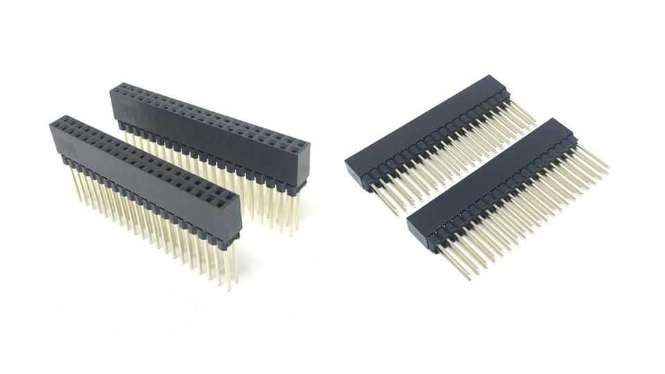
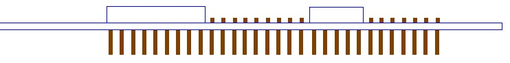
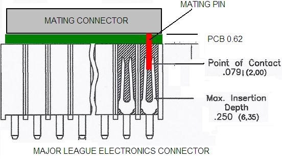

[[cape-board-support-1]]
== Cape Board Support

*BeagleBone AI-64* has the ability to accept up to 
four EEPROM addressable expansion boards or capes stacked onto 
the expansion headers. The word cape comes from the shape of the
expansion board for BeagleBone boards as it is fitted around the
Ethernet connector on the main board. For BeagleBone this notch acts as a 
key to ensure proper orientation of the cape. On AI-64 you can see a clear
silkscreen marking for the cape orientation. Most of BeagleBone capes
can be used with your BeagleBone AI-64 also like shown in <<bbai-cape-placement-figure>> below.

[[bbai-cape-placement-figure, BeagleBone Ai Cape Placement figure]]

This section describes the rules & guidelines for creating capes to ensure proper
operation with BeagleBone AI-64 and proper interoperability with
other capes that are intended to coexist with each other. Co-existence
is not a requirement and is in itself, something that is impossible to
control or administer. But, people will be able to create capes that
operate with other capes that are already available based on public
information as it pertains to what pins and features each cape uses.
This information will be able to be read from the EEPROM on each cape.

For those wanting to create their own capes this should not put limits on the creation of
capes and what they can do, but may set a few basic rules that will allow
the software to administer their operation with BeagleBone AI-64. For this
reason there is a lot of flexibility in the specification that we hope
most people will find it liberating in the spirit of Open Source
Hardware. On the other hand we are sure that there are others who would like to see tighter
control, more details, more rules and much more order to the way capes
are handled.

Over time, this specification will change and be updated, so please
refer to the https://git.beagleboard.org/beagleboard/beaglebone-ai-64/[latest version of this manual]
prior to designing your own capes to get the latest information.

[WARNING]
Do not apply voltage to any I/O pin when power is not supplied to the board.
It will damage the processor and void the warranty. 

[[beaglebone-ai-64-cape-compatibility]]
=== BeagleBone AI-64 Cape Compatibility

The expansion headers on BeagleBone Black and BeagleBone AI-64 provides
similar pin configuration options on P8 and P9 expansion header pins thus provide 
cape compatibility to a certain extent. Which means most BeagleBone Black capes
will also be compatible with BeeagleBone AI-64.

[IMPORTANT]
This section is still being worked on, please make sure you have the
latest system reference manual (SRM).

#TODO: Add BeagleBone AI-64 LCD pins information#

#TODO: Add BeagleBone AI-64 eMMC pins information#

[[eeprom]]
=== EEPROM

Each cape must have its own EEPROM containing information that will
allow the software to identify the board and to configure the expansion
headers pins during boot as needed. The one exception is proto boards intended for
prototyping. They may or may not have an EEPROM on them. An EEPROM is
required for all capes sold in order for them operate correctly when
plugged into BeagleBone AI-64.

The address of the EEPROM will be set via either jumpers or a dipswitch
on each expansion board. <<expansion-board-eeprom-without-write-protect-figure>> 
below is the design of the EEPROM circuit.

[[expansion-board-eeprom-without-write-protect-figure, Expansion board EEPROM without write protect figure]]
image::images/ch08/eeprom.png[title="Expansion board EEPROM without write protect"]

The addressing of this device requires two bytes for the address which
is not used on smaller size EEPROMs, which only require only one byte.
Other compatible devices may be used as well. Make sure the device you
select supports 16 bit addressing. The part package used is at the
discretion of the cape designer.

[[eeprom-address]]
==== EEPROM Address

In order for each cape to have a unique address, a board ID scheme is
used that sets the address to be different depending on the setting of
the dipswitch or jumpers on the capes. A two position dipswitch or
jumpers is used to set the address pins of the EEPROM.

It is the responsibility of the user to set the proper address for each
board and the position in the stack that the board occupies has nothing
to do with which board gets first choice on the usage of the expansion
bus signals. The process for making that determination and resolving
conflicts is left up to the SW and, as of this moment in time, this
method is a something of a mystery due to the new Device Tree
methodology introduced in the 3.8 kernel.

Address line A2 is always tied high. This sets the allowable address
range for the expansion cards to *0x54* to**0x57**. All other I2C
addresses can be used by the user in the design of their capes. But,
these addresses must not be used other than for the board EEPROM
information. This also allows for the inclusion of EEPROM devices on the
cape if needed without interfering with this EEPROM. It requires that A2
be grounded on the EEPROM not used for cape identification.

[[i2c-bus]]
==== I2C Bus

The EEPROMs on each expansion board are connected to I2C2 on connector
P9 pins 19 and 20. For this reason I2C2 must always be left connected
and should not be changed by SW to remove it from the expansion header
pin mux settings. If this is done, the system will be unable to detect
the capes.

The I2C signals require pullup resistors. Each board must have a 5.6K
resistor on these signals. With four capes installed this will result in
an effective resistance of 1.4K if all capes were installed and all the
resistors used were exactly 5.6K. As more capes are added the resistance
is reduced to overcome capacitance added to the signals. When no capes
are installed the internal pullup resistors must be activated inside the
processor to prevent I2C timeouts on the I2C bus.

The I2C2 bus may also be used by capes for other functions such as I/O
expansion or other I2C compatible devices that do not share the same
address as the cape EEPROM.

[[eeprom-write-protect]]
==== EEPROM Write Protect

The design in <<expansion-board-eeprom-with-write-protect-figure>>
has the write protect disabled. If the write
protect is not enabled, this does expose the EEPROM to being corrupted
if the I2C2 bus is used on the cape and the wrong address written to. It
is recommended that a write protection function be implemented and a
Test Point be added that when grounded, will allow the EEPROM to be
written to. To enable write operation, Pin 7 of the EEPROM must be tied
to ground.

When not grounded, the pin is HI via pullup resistor R210 and therefore
write protected. Whether or not Write Protect is provided is at the
discretion of the cape designer.

*Variable & MAC Memory*

VSYS_IO_3V3

[[expansion-board-eeprom-with-write-protect-figure, Expansion board EEPROM with write protect figure]]
image::images/ch08/eeprom-write-protect.png[title="Expansion board EEPROM with write protect"]

[[eeprom-data-format]]
==== EEPROM Data Format

<<expansion-board-eeprom-table>> 
shows the format of the contents of the expansion board
EEPROM. Data is stored in Big Endian with the least significant value on
the right. All addresses read as a single byte data from the EEPROM, but
two byte addressing is used. ASCII values are intended to be easily read
by the user when the EEPROM contents are dumped.

#Clean/Update table#

[[expansion-board-eeprom-table, Expansion Board EEPROM table]]
[cols=",,,",options="header",]
|=======================================================================
|*Name* |*Offset* |*Size (bytes)* |*Contents*
|*Header* |*0* |*4* |*0xAA, 0x55, 0x33, 0xEE*

|*EEPROM Revision* |*4* |*2* |*Revision number of the overall format of
this EEPROM in ASCII =A1*

|*Board Name* |*6* |*32* |*Name of board in ASCII so user can read it
when the EEPROM is dumped. Up to developer of the board as to what they
call the board..*

|*Version* |*38* |*4* |*Hardware version code for board in ASCII.
Version format is up to the developer.* *i.e. 02.1…00A1....10A0*

|*Manufacturer* |*42* |*16* |*ASCII name of the manufacturer. Company or
individual’s name.*

|*Part Number* |*58* |*16* |*ASCII Characters for the part number. Up to
maker of the board.*

|*Number of Pins* |*74* |*2* |*Number of pins used by the daughter board
including the power pins used. Decimal value of total pins 92 max,
stored in HEX.*

|*Serial Number* |*76* |*12* |*Serial number of the board. This is a 12
character string which is:* +
*WWYY&&&&nnnn* +
*where: WW = 2 digit week of the year of production* +
*YY = 2 digit year of production* +
*&&&&=Assembly code to let the manufacturer document the assembly number
or product. A way to quickly tell from reading the serial number what
the board is. Up to the developer to determine.* *nnnn = incrementing
board number for that week of production*

|*Pin Usage* |*88* |*148* |**Two bytes** *for each configurable pins of
the 74 pins on the expansion* +
*connectors* **MSB LSB** +
*Bit order: 15..14 ..... 1..0* +
*Bit 15....Pin is used or not...0=Unused by cape 1=Used by cape* +
*Bit 14-13...Pin Direction.....1 0=Output 01=Input 11=BDIR* +
*Bits 12-7...Reserved........should be all zeros* +
*Bit 6....Slew Rate .......0=Fast 1=Slow* +
*Bit 5....Rx Enable.......0=Disabled 1=Enabled* +
*Bit 4....Pull Up/Dn Select....0=Pulldown 1=PullUp* +
*Bit 3....Pull Up/DN enabled...0=Enabled 1=Disabled* +
*Bits 2-0 ...Mux Mode Selection...Mode 0-7*

|*VSYS_IO_3V3 Current* |*236* |*2* |*Maximum current in milliamps. This is
HEX value of the current in decimal* +
*1500mA=0x05 0xDC 325mA=0x01 0x45*

|*DC_VDD_5V Current* |*238* |*2* |*Maximum current in milliamps. This is
HEX value of the current in decimal* +
*1500mA=0x05 0xDC 325mA=0x01 0x45*

|*VSYS_5V0 Current* |*240* |*2* |*Maximum current in milliamps. This is
HEX value of the current in decimal* +
*1500mA=0x05 0xDC 325mA=0x01 0x45*

|*DC Supplied* |*242* |*2* |*Indicates whether or not the board is
supplying voltage on the DC_VDD_5V rail and the current rating 000=No
1-0xFFFF is the current supplied storing the decimal* +
*equivalent in HEX format*

|*Available* |*244* |*32543* |*Available space for other non-volatile
codes/data to be used as needed by the manufacturer or SW driver. Could
also store presets for use by SW.*
|=======================================================================

[[pin-usage]]
==== Pin Usage

<<eeprom-pin-usage-table>> shows the locations in the EEPROM to set the I/O pin usage for
the cape. It contains the value to be written to the Pad Control
Registers. Details on this can be found in section *9.2.2* of the
*TDA4VM Technical Reference Manual*, The table is left blank as a
convenience and can be printed out and used as a template for creating a
custom setting for each cape. The 16 bit integers and all 16 bit fields
are to be stored in Big Endian format.

*Bit 15 PIN USAGE* is an indicator and should be a 1 if the pin is
used or 0 if it is unused.

*Bits 14-7 RESERVED* is not to be used and left as 0.

*Bit 6 SLEW CONTROL* 0=Fast 1=Slow

*Bit 5 RX Enabled* 0=Disabled 1=Enabled

*Bit 4 PU/PD* 0=Pulldown 1=Pullup.

*Bit 3 PULLUP/DN* 0=Pullup/pulldown enabled

1= Pullup/pulldown disabled

*Bit 2-0 MUX MODE SELECT* Mode 0-7. (refer to TRM)

Refer to the TRM for proper settings of the pin MUX mode based on the
signal selection to be used.

The *AIN0-6* pins do not have a pin mux setting, but they need to be set
to indicate if each of the pins is used on the cape. Only bit 15 is used
for the AIN signals.

#Add tables#

[[eeprom-pin-usage-table, EEPROM Pin Usage table]]

[[p8-header-pins-table, P8 header pins table]]

[[p9-header-pins-table, P9 header pins table]]

[[pin-usage-consideration]]
=== Pin Usage Consideration

This section covers things to watch for when hooking up to certain pins
on the expansion headers.

[[expansion-connectors-1]]
=== Expansion Connectors

A combination of male and female headers is used for access to the
expansion headers on the main board. There are three possible mounting
configurations for the expansion headers:

* _Single_-no board stacking but can be used on the top of the stack.
* _Stacking_-up to four boards can be stacked on top of each other.
* _Stacking with signal stealing_-up to three boards can be stacked on
top of each other, but certain boards will not pass on the signals they
are using to prevent signal loading or use by other cards in the stack.

The following sections describe how the connectors are to be implemented
and used for each of the different configurations.

[[non-stacking-headers-single-cape]]
==== Non-Stacking Headers-Single Cape

For non-stacking capes single configurations or where the cape can be
the last board on the stack, the two 46 pin expansion headers use the
same connectors. <<single-expansion-connector-figure>> is a picture of 
the connector. These are dual row 23 position 2.54mm x 2.54mm connectors.

[[single-expansion-connector-figure,Single expansion connector figure]]
image::images/ch08/single-expansion-connector.jpg[title="Single expansion connector"]

The connector is typically mounted on the bottom side of the board as
shown in <<single-cape-expansion-connector-figure>>. These are very common connectors and should be
easily located. You can also use two single row 23 pin headers for each
of the dual row headers.

image::images/ch08/proto.jpg[title="Single cape expansion connector on BeagleBone Proto Cape with EEPROM from onlogic"]

[[single-cape-expansion-connector-figure, Single cape expansion connector figure]]

It is allowed to only populate the pins you need. As this is a
non-stacking configuration, there is no need for all headers to be
populated. This can also reduce the overall cost of the cape. This
decision is up to the cape designer.

For convenience listed in <<single-cape-connectors-figure>> are some possible 
choices for part numbers on this connector. They have varying pin lengths and 
some may be more suitable than others for your use. It should be noted, that the
longer the pin and the further it is inserted into BeagleBone AI-64
connector, the harder it will be to remove due to the tension on 92
pins. This can be minimized by using shorter pins or removing those pins
that are not used by your particular design. The first item in**Table
18** is on the edge and may not be the best solution. Overhang is the
amount of the pin that goes past the contact point of the connector on
BeagleBone AI-64

.

[[single-cape-connectors-figure, Single Cape Connectors]]
[cols=",,,",options="header",]
|=======================================================================
|*SUPPLIER* |*PARTNUMBER* |*TAIL LENGTH(in)* |*OVERHANG(in)*
|http://www.mlelectronics.com/[_Major League_] |TSHC-123-D-03-145-G-LF
|.145 |.004

|http://www.mlelectronics.com/[_Major League_] |TSHC-123-D-03-240-G-LF
|.240 |.099

|http://www.mlelectronics.com/[_Major League_] |TSHC-123-D-03-255-G-LF
|.255 |.114
|=======================================================================

The G in the part number is a plating option. Other options may be used
as well as long as the contact area is gold. Other possible sources are
Sullins and Samtec for these connectors. You will need to ensure the
depth into the connector is sufficient

[[main-expansion-headers-stacking]]
==== Main Expansion Headers-Stacking

For stacking configuration, the two 46 pin expansion headers use the
same connectors. <<expansion-connector-figure>> is a picture of the 
connector. These are dual row 23 position 2.54mm x 2.54mm connectors.

[[expansion-connector-figure, Expansion connector figure]]

The connector is mounted on the top side of the board with longer tails
to allow insertion into BeagleBone AI-64. 
<<stacked-cape-expansion-connector-figure>> is the
connector configuration for the connector.

[[stacked-cape-expansion-connector-figure, Stacked cape expansion connector figure]]

For convenience listed in *Table 18* are some possible choices for part
numbers on this connector. They have varying pin lengths and some may be
more suitable than others for your use. It should be noted, that the
longer the pin and the further it is inserted into BeagleBone AI-64
connector, the harder it will be to remove due to the tension on 92
pins. This can be minimized by using shorter pins. There are most likely
other suppliers out there that will work for this connector as well. If
anyone finds other suppliers of compatible connectors that work, let us
know and they will be added to this document. The first item in**Table
19** is on the edge and may not be the best solution. Overhang is the
amount of the pin that goes past the contact point of the connector on
BeagleBone AI-64.

The third part listed in <<stacked-cape-connectors-figure>> will have 
insertion force issues.

[[stacked-cape-connectors-figure, Stacked cape connectors figure]]
[cols=",,,",options="header",]
|=======================================================================
|*SUPPLIER* |*PARTNUMBER* |*TAIL LENGTH(in)* |*OVERHANG(in)*
|http://www.mlelectronics.com/[_Major League_] |SSHQ-123-D-06-G-LF |.190
|0.049

|http://www.mlelectronics.com/[_Major League_] |SSHQ-123-D-08-G-LF |.390
|0.249

|http://www.mlelectronics.com/[_Major League_] |SSHQ-123-D-10-G-LF |.560
|0.419
|=======================================================================

There are also different plating options on each of the connectors
above. Gold plating on the contacts is the minimum requirement. If you
choose to use a different part number for plating or availability
purposes, make sure you do not select the “LT” option.

Other possible sources are Sullins and Samtec but make sure you select
one that has the correct mating depth.

[[stacked-capes-wsignal-stealing]]
==== Stacked Capes w/Signal Stealing

<<stacked-with-signal-stealing-expansion-connector-figure>> is the connector configuration for stackable capes that does
not provide all of the signals upwards for use by other boards. This is
useful if there is an expectation that other boards could interfere with
the operation of your board by exposing those signals for expansion.
This configuration consists of a combination of the stacking and
nonstacking style connectors.

[[stacked-with-signal-stealing-expansion-connector-figure, Stacked with signal stealing expansion connector figure]]

[[retention-force]]
==== Retention Force

The length of the pins on the expansion header has a direct relationship
to the amount of force that is used to remove a cape from BeagleBone
AI-64. The longer the pins extend into the connector the harder it is to
remove. There is no rule that says that if longer pins are used, that
the connector pins have to extend all the way into the mating connector
on BeagleBone AI-64, but this is controlled by the user and
therefore is hard to control. We have also found that if you use gold
pins, while more expensive, it makes for a smoother finish which reduces
the friction.

This section will attempt to describe the tradeoffs and things to
consider when selecting a connector and its pin length.

[[beaglebone-ai-64-female-connectors]]
==== BeagleBone AI-64 Female Connectors

<<connector-pin-insertion-depth>> shows the key measurements used in calculating how much the
pin extends past the contact point on the connector, what we call
overhang.

[[connector-pin-insertion-depth, Connector pin insertion depth figure]]

To calculate the amount of the pin that extends past the Point of
Contact, use the following formula:

Overhang=Total Pin Length- PCB thickness (.062) - contact point (.079)

The longer the pin extends past the contact point, the more force it
will take to insert and remove the board. Removal is a greater issue
than the insertion.

[[signal-usage]]
=== Signal Usage

Based on the pin muxing capabilities of the processor, each expansion
pin can be configured for different functions. When in the stacking
mode, it will be up to the user to ensure that any conflicts are
resolved between multiple stacked cards. When stacked, the first card
detected will be used to set the pin muxing of each pin. This will
prevent other modes from being supported on stacked cards and may result
in them being inoperative.

In <<section-7-1>> of this document, the functions of the pins are defined
as well as the pin muxing options. Refer to this section for more
information on what each pin is. To simplify things, if you use the
default name as the function for each pin and use those functions, it
will simplify board design and reduce conflicts with other boards.

Interoperability is up to the board suppliers and the user. This
specification does not specify a fixed function on any pin and any pin
can be used to the full extent of the functionality of that pin as
enabled by the processor.

*DO NOT APPLY VOLTAGE TO ANY I/O PIN WHEN POWER IS NOT SUPPLIED TO THE
BOARD. IT WILL DAMAGE THE PROCESSOR AND VOID THE WARRANTY.*

*NO PINS ARE TO BE DRIVEN UNTIL AFTER THE SYS_RESET LINE GOES HIGH.*

[[cape-power]]
=== Cape Power

This section describes the power rails for the capes and their usage.

[[main-board-power]]
==== Main Board Power

The <<expansion-header-voltages-table>> describes the voltages from the 
main board that are available on the expansion connectors and their ratings. 
All voltages are supplied by connector**P9**. The current ratings listed are per pin.

[[expansion-header-voltages-table, Expansion header voltages figure]]
[cols=",,,,,",options="header",]
|============================================
|*Current* |*Name* |*P9* |*P9* |*Name* |*Current*
|250mA |VSYS_IO_3V3 |3 |4 |VSYS_IO_3V3 |250mA
|1000mA |DC_VDD_5V |5 |6 |DC_VDD_5V |1000mA
|250mA |VSYS_5V0 |7 |8 |VSYS_5V0 |250mA
|============================================

The *VSYS_IO_3V3* rail is supplied by the LDO on BeagleBone AI-64 and
is the primary power rail for expansion boards. If the power requirement
for the capes exceeds the current rating, then locally generated voltage
rail can be used. It is recommended that this rail be used to power any
buffers or level translators that may be used.

*DC_VDD_5V* is the main power supply from the DC input jack. This voltage
is not present when the board is powered via USB. The amount of current
supplied by this rail is dependent upon the amount of current available.
Based on the board design, this rail is limited to 1A per pin from the
main board.

The *VSYS_5V0* rail is the main rail for the regulators on the main board.
When powered from a DC supply or USB, this rail will be 5V. The
available current from this rail depends on the current available from
the USB and DC external supplies.

[[expansion-board-external-power]]
==== Expansion Board External Power

A cape can have a jack or terminals to bring in whatever voltages may be
needed by that board. Care should be taken not to let this voltage be
fed back into any of the expansion header pins.

It is possible to provide 5V to the main board from an expansion board.
By supplying a 5V signal into the *DC_VDD_5V* rail, the main board can be
supplied. This voltage must not exceed 5V. You should not supply any
voltage into any other pin of the expansion connectors. Based on the
board design, this rail is limited to 1A per pin to BeagleBone
AI-64.

*There are several precautions that need to be taken when working with
the expansion headers to prevent damage to the board.*

1.  *Do not apply any voltages to any I/O pins when the board is not
powered on.*
2.  *Do not drive any external signals into the I/O pins until after the
VSYS_IO_3V3 rail is up.*
3.  *Do not apply any voltages that are generated from external
sources.*
4.  *If voltages are generated from the DC_VDD_5V signal, those supplies
must not become active until after the VSYS_IO_3V3 rail is up.*
5.  *If you are applying signals from other boards into the expansion
headers, make sure you power the board up after you power up the
BeagleBone AI-64 or make the connections after power is applied on both
boards.*

*Powering the processor via its I/O pins can cause damage to the
processor.*

#TODO: Add BeagleBone AI-64 cape mechanical characteristics#

[[standard-cape-size]]
==== Standard Cape Size

<<cape-board-dimensions-figure>> shows the outline of the standard cape.
The dimensions are in inches.

[[cape-board-dimensions-figure, Cape board dimensions figure]]
image::images/ch08/cape-dimension.jpg[title="Cape board dimensions"]

A notch is provided for BeagleBone Ethernet connector to stick up higher than
the cape when mounted. This also acts as a key function to ensure that
the cape is oriented correctly. Space is also provided to allow access
to the user LEDs and reset button on BeagleBone board. On BeagleBone AI-64 board
align it with the notch on the board silkscreen.

[[extended-cape-size]]
==== Extended Cape Size

Capes larger than the standard board size are also allowed. A good
example would be the new BeagleBone AI-64 robotics cape. 
There is no practical limit to the sizes of these types of boards.
The notch is also optional, but it is up to the supplier to ensure that the
cape is not plugged incorrectly on BeagleBone AI-64 such that damage would
be cause to BeagleBone AI-64. Any such damage will be the responsibility of the
supplier of such a cape to repair. As with all capes, the EEPROM is required and 
compliance with the power requirements must be adhered to.

