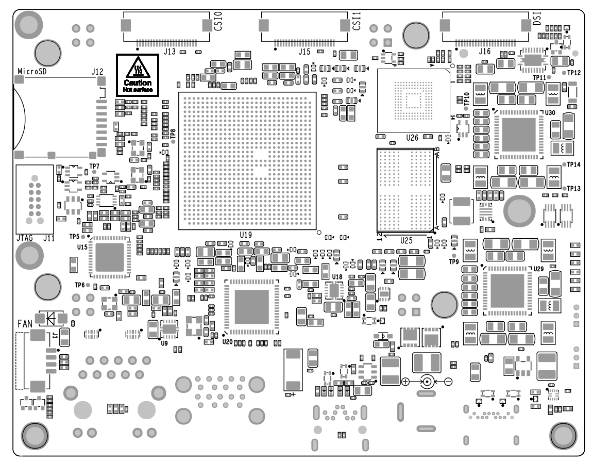
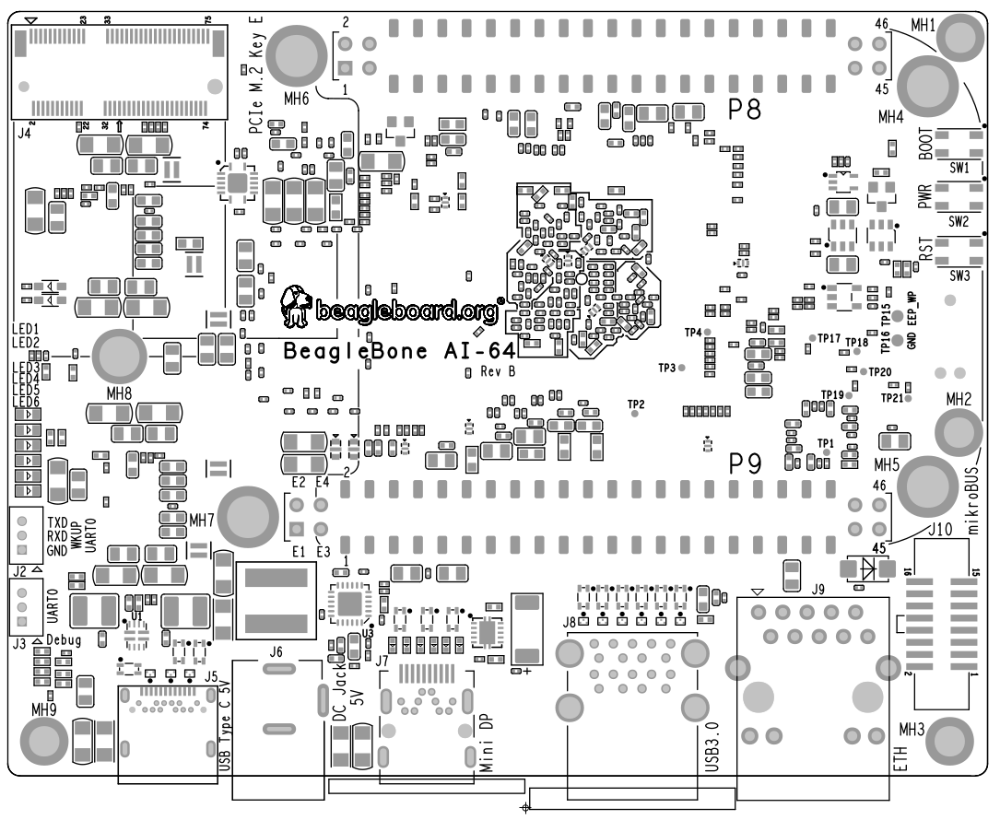

[[section-9,Section 9.0 BeagleBone AI-64 Mechanical]]
== BeagleBone AI-64 Mechanical

[[dimensions-and-weight]]
=== Dimensions and Weight

Size: 102.5 x 80 (4" x 3.15")

Max height: #TODO#

PCB Layers: #TODO#

PCB thickness: 2mm (0.08")

RoHS Compliant: Yes

Weight: 192gm

[[silkscreen-and-component-locations]]
=== Silkscreen and Component Locations

image::images/ch09/board-dimensions.jpg[title="Board Dimensions"]

